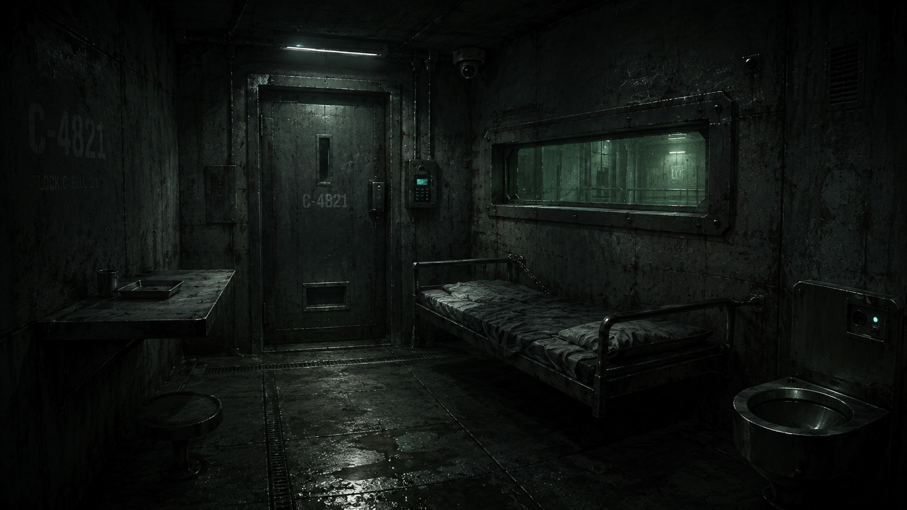
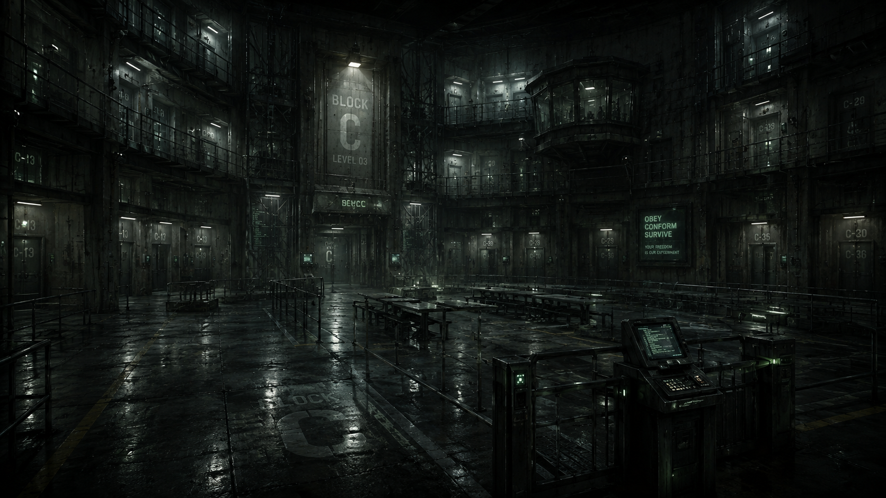
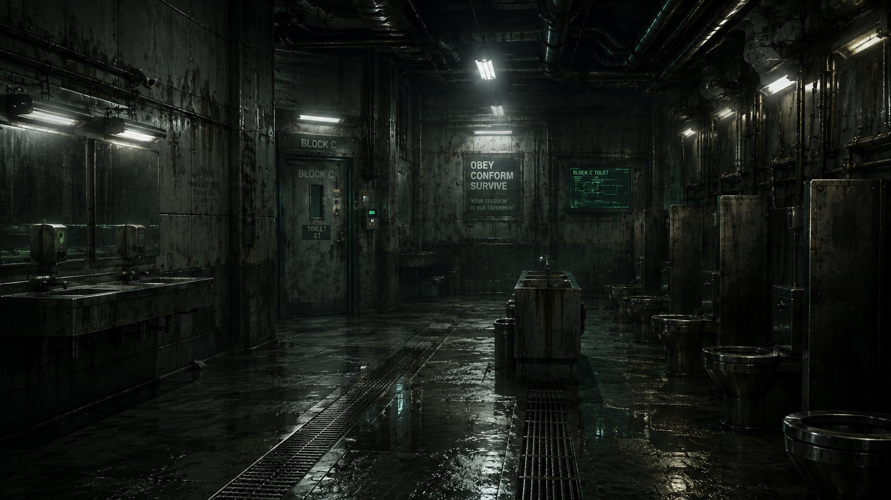
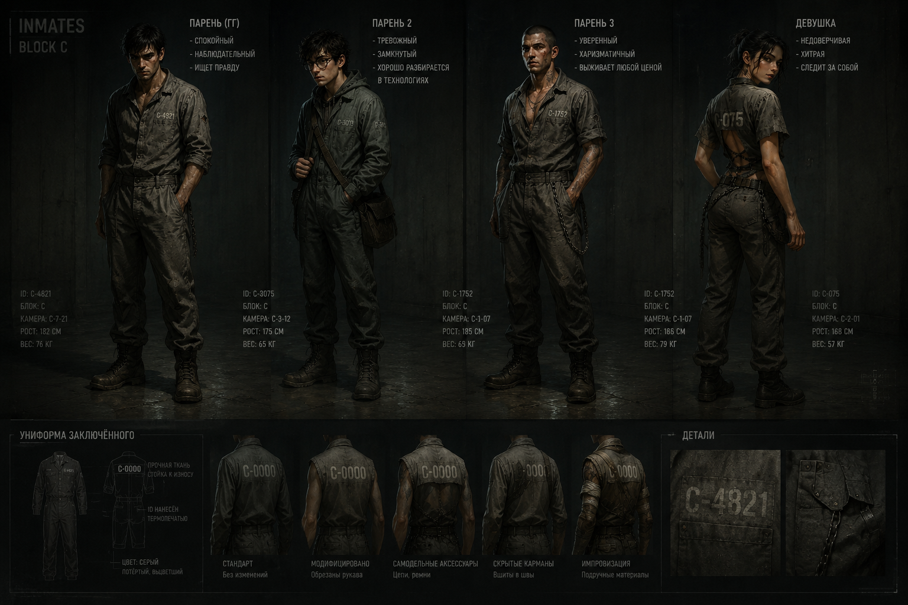
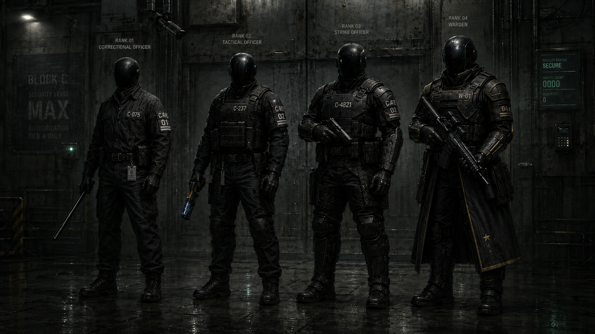

# Визуальный стиль игры (art bible)

Ответственный за визуал: автор игры
Технический пайплайн: Claude Code
Последнее обновление: 2026-06-13

Назначение: единый источник правды по визуальному стилю, размерам и палитре,
плюс готовые «заготовки» для генерации новых ассетов (персонажи, тайлы, текстуры).
Размеры мира — в коде живут в `Assets/Scripts/WorldMetrics.cs`, менять там.

---

## 1. Общий вайб

Мрачный, грязный антиутопично-тюремный / промышленный сеттинг с холодным
зелёным подтоном. Изношенные материалы: бетон, ржавчина, потёртая ткань,
тусклый металл. Точечные акценты — зелёные CRT-экраны (консоли, кейпады, двери).
Детальный пиксель-арт, тёмная низко-насыщенная палитра, холодные тени с лёгкой
зеленцой, тёплая ржавчина как единственный тёплый акцент.

## 1a. Концепт-арт (референсы атмосферы)

Эталоны настроения и материалов (`Design/concept/`). Прикладывай их как
референс при генерации окружения.

-  **Камера героя (C-4821).**
  Тесная бетонная камера: тяжёлая металлическая дверь с глазком и кейпадом
  (зелёный LED), окно-иллюминатор с зеленоватым свечением коридора, стальная
  койка с грязным матрасом, откидной столик, стальной унитаз, купольная
  камера наблюдения, люминесцентная лампа-полоска. Трафарет «C-4821»,
  «BLOCK C CELL» на бетоне.
-  **Атриум блока C (паноптикум).**
  Многоярусный блок камер вокруг центрального зала, будка охраны, ряды
  столовых столов, турникеты-консоли. Гигантские трафареты «BLOCK C / LEVEL 03»,
  номера камер (C-13, C-30…), пропаганда «OBEY · CONFORM · SURVIVE / YOUR
  FREEDOM IS OUR EXPERIMENT». Мокрый отражающий пол с разметкой.
-  **Санузел блока C.**
  Мокрый бетонный коридор-санузел: стальные раковины/унитазы/писсуары, зеркала,
  открытые трубы и кабель-каналы по потолку, дренажные решётки в полу, зелёный
  настенный CRT-экран, люминесцентные полоски.

**Извлечённые мотивы (использовать в ассетах окружения):**
- Тяжёлый литой бетон с вертикальными следами опалубки, сильные вертикальные
  потёки воды/ржавчины, трещины, пятна тёмной плесени/налёта.
- Клёпаные стальные панели и усиленные рамы; решётки, поручни, каркасы коек,
  стальная сантехника.
- Мокрые полы: лужи и матовый блеск, длинные дренажные каналы с решётками,
  выцветшая краска-разметка (жёлтые линии, крупные трафареты «BLOCK C», номера).
- Свет: редкие зеленовато-белые люминесцентные полоски, светящиеся зелёные
  CRT-мониторы/кейпады, купольные камеры; почти чёрные тени, высокий контраст.
- Сигнатура надзора и пропаганды: трафаретные ID камер (C-XXXX), лозунги «OBEY ·
  CONFORM · SURVIVE», «YOUR FREEDOM IS OUR EXPERIMENT», «BLOCK C / LEVEL 03».
- Открытые трубы и кабель-каналы по потолкам; клаустрофобия, надзор, эксперимент.

---

## 2. Палитра (HEX)

Базовая (из `tools/sprite_lib.py`):

| Роль | HEX | Заметка |
|------|-----|---------|
| Контур | `#060907` | тёмный контур силуэтов |
| Глубокая тень | `#0a0d0b` | контактные тени |
| Rim-свет | `#608066` | холодный зелёный край (свет сверху-слева) |
| Бетон (база) | `#2c322c` | стены/пол, зеленовато-серый |
| Зелёный glow | `#82eb96` | CRT-свечение, самый яркий акцент |
| Зелёный hi | `#58c470` | tech-подсветка |
| Зелёный mid | `#34804a` | экраны, рамки |
| Зелёный dark | `#183422` | стекло экранов |
| Зелёный darkest | `#0e1e14` | глубина экрана |
| Роба (рубаха) | `#5e6054` | серо-оливковая ткань заключённых |
| Штаны | `#484a40` | темнее робы |
| Комбинезон | `#364034` | капюшонный (программист) |
| Охрана (чёрное) | `#181a1e` | амуниция надзирателей |
| Кожа | `#a4866e` | смуглая |
| Сталь | `#6e7472` | инструменты, поручни |
| Оружейный металл | `#3e4248` | gunmetal |
| Ботинки | `#22211d` | тёмно-коричнево-чёрные |
| Трафарет-текст | `#9ea090` | номера/надписи на робах |

Правила: тени уходят в зелёный, света — холодные; тёплых/ярких цветов нет,
кроме рыжей ржавчины-акцента (`#6b3a22`–`#8a4a2a`).

---

## 3. Главный герой (канон)

Заключённый C-4821. Молодой смуглый мужчина худощавого телосложения, усталое
лицо, тёмные глаза, густые брови, короткая щетина, тёмные растрёпанные вьющиеся
чёрные волосы. Одежда: изношенный тёмный серо-оливковый тюремный комбинезон
(база ~`#3b3b34`, тени ~`#26261f`, света ~`#4d4d44`), рукава закатаны до
предплечий, шнурок-завязка на поясе, нагрудный карман, карго-карман на бедре,
рыжевато-бурые пятна и заплатки. Коричневые поношенные кожаные ботинки на
шнуровке.

## 3a. Заключённые блока C (каст)



Все носят серую тюремную робу с термопечатным ID `C-XXXX` (крупно на спине и на
груди). У каждого — ID, камера, рост, вес, характер.

| Персонаж | ID | Камера | Рост/Вес | Характер | Внешность |
|----------|----|--------|----------|----------|-----------|
| **Парень (ГГ)** | C-4821 | C-7-21 | 182 см / 76 кг | спокойный, наблюдательный, ищет правду | тёмные растрёпанные волосы, щетина (см. §3) |
| **Парень 2** | C-3075 | C-3-12 | 175 см / 65 кг | тревожный, замкнутый, технарь | очки, сумка-сатчел через плечо |
| **Парень 3** | C-1752 | C-1-07 | 185 см / ~75 кг | уверенный, харизматичный, выживает любой ценой | бритая голова, шрамы, тату, цепь, расстёгнутый ворот |
| **Девушка** | C-075 | C-2-01 | 168 см / 57 кг | недоверчивая, хитрая, следит за собой | тёмные собранные волосы, открытая спина, цепь на бедре |

**Униформа заключённого:** прочная износостойкая ткань, цвет серый потёртый,
выцветший; ID нанесён термопечатью. Варианты ношения (читаются по силуэту):
**Стандарт** (без изменений) · **Модифицировано** (обрезаны рукава) ·
**Самодельные аксессуары** (цепи, ремни) · **Скрытые карманы** (вшиты в швы) ·
**Импровизация** (подручные материалы — бинты/обмотки).

## 3b. Охрана блока C (ранги)



Все надзиратели **безликие** — глянцевые чёрные шлемы без лица (мотив «как в игре
в кальмара»: анонимность + жёсткая иерархия). Форма чёрная тактическая; **ранг
читается по плотности брони и снаряжению**, золото — признак командования. На
груди — нашивка с ID и номером ранга (01–04). Виды оружия у рангов разные (пока
без проработки — эскалация от дубинки к винтовке).

| Ранг | Звание | Силуэт / броня | Оружие (черновик) | Нашивка |
|------|--------|----------------|-------------------|---------|
| **01** | Correctional Officer | лёгкая: форма + гладкий шлем, бейдж на шнурке | телескопическая дубинка | C-075 · 01 |
| **02** | Tactical Officer | шлем с визором, плитоноска с подсумками | электродубинка/шокер (синее свечение) | C-237 · 02 |
| **03** | Strike Officer | тяжёлая броня: наплечники, наколенники, бронепластины | пистолет | C-4821 · 03 |
| **04** | Warden | максимум брони + длинный плащ с золотым кантом и звездой | карабин/винтовка | W-01 · 04 |

Общее: матовый чёрный тактический материал, мокрые блики, ноль индивидуальности
(только номер). Тема «все — номера»: заключённые `C-XXXX`, охрана пронумерована,
начальник тюрьмы — `W-01`. Контекст таблички: «BLOCK C · SECURITY LEVEL MAX ·
AUTHORIZATION TIER 4 ONLY», панель статуса «SECURE / INMATE COUNT / BLOCKERS».

## 3c. Размеры и масштаб персонажей (для генерации/импорта)

Базовые правила для ЛЮБОГО персонажа (герой, заключённые, охрана, NPC). Полный
рендер мира — в §4, пайплайн импорта — в §6.

- **Формат спрайта:** холст **256×256 px**, прозрачный PNG, **point-фильтр**,
  пивот **низ-центр** (ступни). Все ракурсы/кадры — в этом формате.
- **Фигура в кадре:** рост **~232 px** (≈90% холста), макушка ≈ y16, ступни на
  общей линии ≈ y248. Кадры одного персонажа — одного роста, ступни на одной
  линии (иначе «прыгает»).
- **Пропорции:** реалистичный взрослый **~7.5–8 голов**. НЕ сжимать/не
  «приземлять» (частая болячка генерации в позах ходьбы).
- **Мировой масштаб:** герой/заключённые/NPC и охрана — `CharacterScale = 1.55`
  (≈1.5 клетки по высоте; см. `WorldMetrics`). Нормализуется по разрешению
  спрайта в коде, поэтому **разрешение влияет только на чёткость, не на размер**.
- **Детализация:** детальный **HD pixel art** (не 8/16-bit), уровень ~1254px
  AI-рендера, ужатого в 256 (см. §7a). Цель — единый стиль со всеми персонажами.
- **Ракурсы:** front (вниз), side (профиль, **смотрит ВЛЕВО**; вправо — `flipX`),
  back (вверх). Анимации — idle + walk_1/2 (+ pickup у героя), см. §5.
- **Импорт:** `tools/import_player_art.py` (вырез белого фона, кроп, ресайз,
  ступни). Листы «3 фигуры в ряд» режутся по белым зазорам; бок генерить
  смотрящим ВЛЕВО (если вправо — отзеркалить при импорте).
- **Консистентность между листами:** одинаковый тон кожи/пропорции держать,
  прикладывая готовый кадр персонажа как референс к каждому следующему листу.

---

## 4. Размеры и рендер

### Персонажи (новый детальный арт — герой)
- Холст спрайта: **256×256 px**, прозрачный PNG.
- Рост фигуры: **~232 px** (≈90% высоты холста), макушка ≈ y16.
- Ступни на общей линии: **y≈248** (низ холста минус ~8 px).
- Центровка: по горизонтали по центру корпуса; в приседе — по центру **головы**.
- Импорт: **PPU 256, point-фильтр (filterMode 0)**, пивот центр (0.5, 0.5).
- Мировой размер нормализуется в `Player.cs`
  (`localScale = CellSize*CharacterScale / spriteSize`) и **не зависит** от
  разрешения спрайта — разрешение влияет только на чёткость.

### Окружение / тайлы (процедурный арт)
- Тайлы: **64×64 px** (исключение `wall_side` — 64×40), PPU = ширина тайла,
  point-фильтр. Пол/стены — **бесшовные**.
- Клетка мира `CellSize = 1` юнит; нахлёст тайлов `TileOverlap = 1.02`.

### Масштаб в мире (`WorldMetrics.cs`)
- Персонаж (`CharacterScale = 1.55`) ≈ 1.5 клетки по высоте.
- Охрана (`GuardScale = 1.45`) — чуть компактнее.
- Высота «бортика» стены `WallHeight = 0.6`.

> ⚠️ Двойная плотность пикселей: герой сейчас в детальном **256px**, а
> окружение/охрана/NPC — в **64px** процедурном арте. Это осознанный выбор
> (детальный герой поверх блочного мира). Если захотим единообразие — поднимать
> разрешение окружения отдельной задачей.

---

## 5. Анимации персонажа

3 ракурса: **front** (вниз), **side** (профиль, смотрит **ВЛЕВО**; вправо —
через `flipX`), **back** (вверх). Имена в `Resources/Sprites/`:
`player`, `player_side`, `player_up` (+ суффиксы).

- **Ходьба**: 2 кадра `_walk_1` / `_walk_2` (крайние фазы шага, противоположные
  ноги). Движок крутит цикл `{walk_1, idle, walk_2, idle}`, `FrameTime = 0.12s`.
  Амплитуда шага умеренная и одинаковая в обоих кадрах.
- **Подбор** (`_pickup_1` наклон, `_pickup_2` глубокий присед к полу): one-shot
  «присел → дотянулся → выпрямился». В приседе фигура **ниже** стойки — высоту
  НЕ нормализовать, масштаб калибруется по ширине головы (целевая голова в
  выводе ≈ 57–58 px).

Полный набор слотов (15): `player`, `player_walk_1/2`, `player_pickup_1/2`
и аналогично `player_side_*`, `player_up_*`. Текущий sheet: см. `_player_sheet.png`
(временный превью-файл) или генерируй заново из спрайтов.

---

## 6. Пайплайн импорта

Скрипт: `tools/import_player_art.py` (Pillow).
`python3 tools/import_player_art.py SRC.png <name> --size 256 [--flip] [--scale F --center head]`

Делает: глобальный вырез белого фона (`min(R,G,B) >= 236` — убирает и замкнутые
карманы между рукой и телом) + эрозия силуэта 2px (срезает светлую обводку) →
кроп → премультипликат-LANCZOS ресайз (без ореола) → холст с центровкой и
ступнями у низа. `--scale` + `--center head` — для приседа (без нормализации
высоты). Листы «две фазы рядом» режутся пополам по чистому белому зазору:
левая → `_1`, правая → `_2`.

---

## 7. Заготовки для генерации (вставлять в промпт)

### 7a. Персонаж / новый ракурс или анимация
```
Стиль — детальный пиксель-арт, как на приложенном референсе. Мрачная, грязная
антиутопично-тюремная стилистика, холодный свет, тени с зеленцой.
ПЕРСОНАЖ (точно как на референсе, не менять): смуглый худощавый молодой мужчина,
тёмные растрёпанные вьющиеся чёрные волосы, щетина; изношенный тёмный
серо-оливковый тюремный комбинезон, закатанные рукава, шнурок на поясе,
нагрудный и карго-карманы, рыжие пятна/заплатки; коричневые ботинки на шнуровке.
МАСШТАБ (критично): тот же зум и рост фигуры в кадре, что на референсе (макушка
и ступни на тех же уровнях), ступни на одной линии пола — чтобы кадры не
«прыгали». Профиль смотрит ВЛЕВО. Прозрачный фон (или чистый белый), фигура по
центру. Для листа из двух фаз — обе фигуры рядом, в одном масштабе, с зазором.
```

### 7b. Тайл / текстура окружения
```
Бесшовно тайлящаяся (seamless tileable) текстура для 2D-игры, детальный
пиксель-арт. Заполняет ВЕСЬ квадратный кадр, без фона и прозрачности.
ПАЛИТРА (строго): тёмный зеленовато-серый бетон (#2c322c–#383f38), почти чёрные
трещины/швы, рыжая ржавчина как акцент, холодная зеленца в тенях; без ярких и
тёплых цветов. Мрачная антиутопично-тюремная/промышленная стилистика.
ТЕХНИЧЕСКИ: края стыкуются при повторении по X и Y без швов; РОВНЫЙ плоский свет
без виньетки/направленного света/градиентов; строго фронтальный ортографический
вид; только поверхность, без предметов/текста/рамок; квадрат 1:1.
```

### 7c. Стена — бетон блока C (бесшовный тайл)
```
Бесшовно тайлящаяся (seamless tileable) текстура СТЕНЫ тюрьмы, детальный
пиксель-арт, вид строго спереди. Заполняет весь квадратный кадр, без фона.
МАТЕРИАЛ: тяжёлый ВЕРТИКАЛЬНО-структурный бетон — выраженные вертикальные следы
опалубки и швы панелей, ряды клёпаных стальных вставок/болтов, глубокие трещины,
вертикальные потёки воды и ржавчины, пятна налёта. Поверхность должна читаться
как СТЕНА/панель (вертикали, металл), а не как пол.
ЦВЕТ — КРИТИЧНО ДЛЯ КОНТРАСТА С ПОЛОМ: пол в игре — СВЕТЛО-СРЕДНИЙ нейтральный
серый бетон. Стена должна быть ЗАМЕТНО ТЕМНЕЕ пола и чуть холоднее — тёмный
графитово-серый. База — тёмно-серый (#2e3334–#34393a), тени/трещины — почти
чёрные (#121516), редкие потёртости/кромки — средне-серые (#54595a, НЕ светлее).
Стена в среднем ТЕМНЕЕ светлого пола примерно на 30–40%.
НЕ зелёный: лишь едва заметный холодный нюанс в тенях. Ржавчина — единственный
тёплый акцент, редкими пятнами.
КОНТРАСТ ВНУТРИ: широкий тональный диапазон, детали (швы, заклёпки, трещины,
потёки) ЧЁТКО читаются и не сливаются — но общая масса тёмная.
ТЕХНИЧЕСКИ: бесшовность по X и Y; РОВНЫЙ плоский свет без виньетки/направленного
света/градиентов; ортографический фронтальный вид; распределённые детали без
одного крупного акцента; только поверхность, без предметов/текста/рамок; 1:1.
```

### 7d. Пол — мокрый бетон тюрьмы (бесшовный тайл)
```
Бесшовно тайлящаяся (seamless tileable) текстура ПОЛА тюрьмы, вид строго
СВЕРХУ (top-down), детальный пиксель-арт. Заполняет весь квадратный кадр, без фона.
МАТЕРИАЛ: затёртый бетон плитами, чёткие швы между плитами, трещины, разводы
грязи, лёгкий неравномерный влажный матовый отлив (БЕЗ ярких направленных бликов
и отражений источников света), мелкая крошка.
ЦВЕТ — ВАЖНО: бетон ХОЛОДНОГО НЕЙТРАЛЬНОГО СЕРОГО, НЕ зелёный. Лишь едва заметный
холодный нюанс в тенях; НЕ уводи всё в зелёный тон. Чуть светлее, чем стены.
Ржавчина — редкий тёплый акцент.
КОНТРАСТ — ВАЖНО: широкий тональный диапазон, почти чёрные трещины/швы на фоне
заметно более светлого бетона — детали должны ЧЁТКО читаться, не сливаться.
База — серый (#4a504e), швы/трещины — почти чёрные (#161a1b), потёртости —
светло-серые (#717774).
ТЕХНИЧЕСКИ: бесшовность по X и Y; РОВНЫЙ плоский свет без виньетки/градиентов;
ортографический вид сверху; РАСПРЕДЕЛЁННЫЕ мелкие детали без одного крупного
акцента (никаких больших одиночных трещин/люков/лужи по центру — иначе видно
повтор); только поверхность, без разметки/текста/предметов/рамок; 1:1.
```

> Примечание: дренажные решётки, разметку и трафареты («BLOCK C», номера,
> жёлтые линии) лучше делать ОТДЕЛЬНЫМИ тайлами-декалями поверх базового пола,
> а не запекать в бесшовную текстуру — иначе при тайлинге будет явный повтор.

### 7e. Крышка стены — верхний торец (бесшовный тайл, вид сверху)
```
Бесшовно тайлящаяся (seamless tileable) текстура ВЕРХА СТЕНЫ (крышка/торец стены),
вид строго СВЕРХУ (top-down), детальный пиксель-арт. Заполняет весь квадратный
кадр, без фона.
МАТЕРИАЛ: тот же тёмный бетон, что и вертикальная грань стены, но это ПЛОСКИЙ
ВЕРХНИЙ ТОРЕЦ, вид сверху: ровная бетонная поверхность с осевшей пылью и грязью,
мелкие трещины и сколы, поперечные следы опалубки, местами налёт.
ЦВЕТ: тёмный графитово-серый, как грань стены, но НЕМНОГО СВЕТЛЕЕ её (верх ловит
рассеянный свет) — чтобы крышка читалась как отдельная горизонтальная плоскость.
База — тёмно-серый (#3a3f40–#42474a), тени/трещины — почти чёрные; без зелени;
ржавчина — редкий тёплый акцент.
ТЕХНИЧЕСКИ: бесшовность по X и Y; РОВНЫЙ плоский свет без виньетки/направленного
света/градиентов; строго ОРТОГРАФИЧЕСКИЙ вид СВЕРХУ; распределённые мелкие детали
без одного крупного акцента; только поверхность, без предметов/текста/рамок; 1:1.
```

---

## 8. Открытые вопросы / TODO
- Единая плотность пикселей окружения vs детальный герой (см. §4).
- Боковое «действие с предметом» (открыть дверь / взять с полки) — арта и слота
  в коде пока нет (`SpriteWalkAnimator` умеет ходьбу + подбор).
