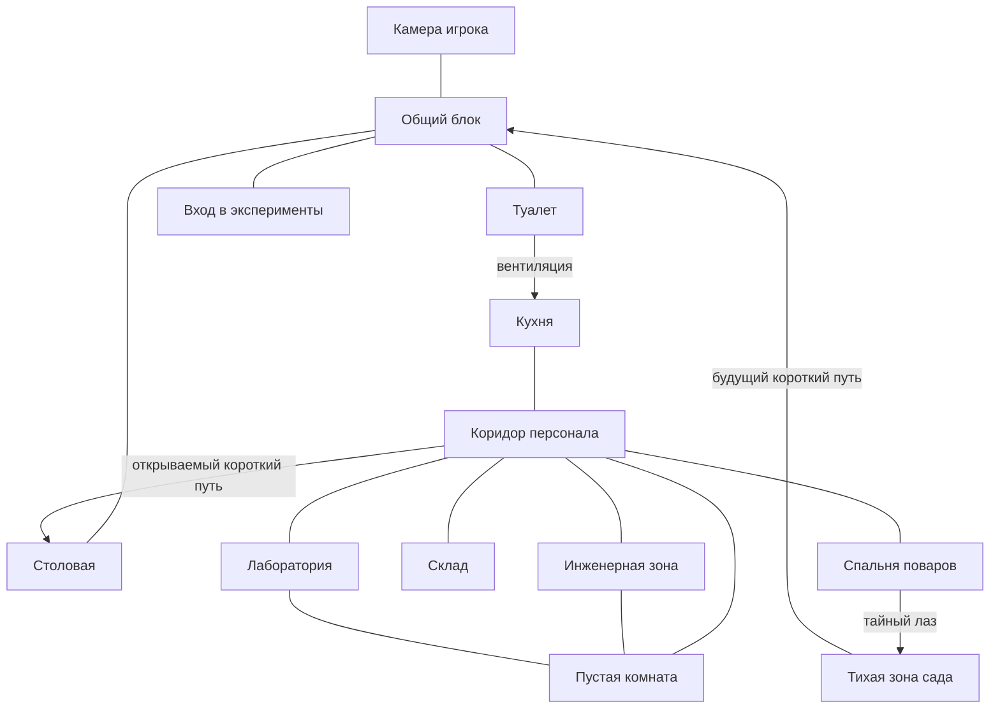

# Level design минимальной тюрьмы

Статус: рабочая гипотеза для первого игрового среза  
Ответственный за геймдизайн: автор игры  
Последнее обновление: 2026-06-10

## Цель первого среза

Создать небольшой связный участок тюрьмы, который игрок постепенно изучает и
переосмысливает. В нём должны работать:

- распорядок и ограниченное время;
- публичные и закрытые маршруты;
- первый квест программиста на глазной имплант;
- базовый стелс;
- возвращение в знакомые комнаты с новыми возможностями;
- первая улика и теория о пустой комнате;
- один опциональный секрет, не нужный для сюжетного продвижения.

## Что берём из Resident Evil

Полицейский участок из **Resident Evil 2** работает не просто как набор
запертых дверей, а как пространственная головоломка:

1. Центральные безопасные или понятные зоны служат ориентирами.
2. Игрок рано видит несколько недоступных мест и запоминает их.
3. Один ключ или инструмент обычно открывает несколько возможностей.
4. Новые проходы создают петли и сокращают уже знакомые маршруты.
5. Возврат в знакомое пространство меняется из-за новых угроз, ресурсов или
   знаний.
6. Обязательные замки двигают сюжет, а дополнительные сейфы и тайники награждают
   любопытство.
7. Карта помогает планировать маршрут и помнить незаконченные дела.

Для нашей игры ресурсное давление Resident Evil заменяется прежде всего
ограниченным свободным временем, распорядком и риском повысить подозрение.

## Что не копируем

- Не запираем каждую дверь отдельным ключом. Это превращает исследование в
  доставку предметов.
- Не строим одну длинную цепочку без ответвлений. Игрок должен иметь хотя бы
  одну необязательную цель и выбор маршрута.
- Не размещаем абстрактные замки без объяснения. Пропуска, коды, вентиляция и
  посты охраны должны соответствовать устройству тюрьмы.
- Не заставляем игрока повторно проходить длинный коридор без нового решения,
  риска или информации.

## Функциональная схема

Семь минимальных функциональных зон из roadmap здесь разложены на физические
помещения. Например, «коридор администрации» включает кухню и служебный
коридор, а «хранилище имплантов» является частью инженерной зоны.

Стрелка обозначает проход, который при первом знакомстве работает только в
указанном направлении. Схема показывает связи, а не физический масштаб.

## Зоны

### Камера игрока

- **Статус:** публичная для игрока, надзиратели могут войти во время проверки.
- **Зачем приходит игрок:** начинает и заканчивает день, устанавливает импланты,
  работает с доской расследования.
- **NPC:** программист во вводном событии; надзиратель при проверке.
- **Связь с распорядком:** подъём, отбой, обязательное возвращение ночью.
- **Первое посещение:** доска пока почти пуста; станция установки имплантов
  доступна, но устанавливать нечего.
- **Открывается позже:** новые теории на доске; установка глазного импланта;
  последствия обыска камеры при высоком личном подозрении.
- **Риск:** низкий, но хранение запрещённых предметов опасно.
- **Соединена с:** общим блоком.

### Общий блок

- **Статус:** публичная.
- **Зачем приходит игрок:** разговоры, знакомства, наблюдение за заключёнными,
  выбор следующей активности.
- **NPC:** программист, заключённая 2, другие заключённые, патрульный
  надзиратель.
- **Связь с распорядком:** главная зона свободного времени и сбора перед
  экспериментом.
- **Первое посещение:** видны входы в камеру, столовую, туалет и эксперименты;
  программист сам подходит к игроку.
- **Открывается позже:** события отношений; короткий путь из сада; скрытая
  камера становится заметна с глазным имплантом.
- **Риск:** низкий при обычном поведении; драка вызывает личное подозрение.
- **Соединена с:** камерой, столовой, туалетом, входом в эксперименты, позднее с
  садом.

### Столовая

- **Статус:** публичная по расписанию, закрытая вне приёма пищи.
- **Зачем приходит игрок:** соблюдает распорядок, подслушивает разговоры,
  наблюдает за дверью персонала.
- **NPC:** заключённые, повара, надзиратели.
- **Связь с распорядком:** завтрак и другие обязательные приёмы пищи.
- **Первое посещение:** дверь персонала открывается только для поваров; через
  окно раздачи видна часть кухни.
- **Открывается позже:** короткий путь из коридора персонала; возможность
  подслушать разговор о сменах охраны.
- **Риск:** низкий в разрешённое время; высокий вне расписания.
- **Соединена с:** общим блоком, позднее с коридором персонала.

### Туалет

- **Статус:** публичная.
- **Зачем приходит игрок:** находит первый скрытый маршрут в служебную часть.
- **NPC:** заключённые заходят ненадолго; надзиратели проверяют при подозрении.
- **Связь с распорядком:** доступен в свободное время.
- **Первое посещение:** повреждённая вентиляционная решётка и звук кухни за
  стеной.
- **Открывается позже:** вентиляция становится проходом после получения
  самодельной отвёртки от программиста; при тревоге решётку могут заменить.
- **Риск:** средний: долгое отсутствие игрока заметно, а открытая решётка
  повышает подозрение зоны.
- **Соединена с:** общим блоком, вентиляцией к кухне.

### Вход в эксперименты

- **Статус:** контролируемая публичная зона.
- **Зачем приходит игрок:** переходит в случайно выбранный эксперимент.
- **NPC:** назначенные участники и надзиратели.
- **Связь с распорядком:** открывается только к назначенному времени.
- **Первое посещение:** демонстрирует, что эксперимент является частью
  тюремного распорядка, а не отдельным меню.
- **Открывается позже:** разные реакции NPC перед играми; сведения о следующем
  эксперименте.
- **Риск:** опоздание и попытка пройти без вызова.
- **Соединена с:** общим блоком.

### Кухня

- **Статус:** закрытая для заключённых.
- **Зачем приходит игрок:** впервые попадает в служебную часть, находит
  сведения о работе персонала и ресурсы для отвлечения.
- **NPC:** повара по расписанию.
- **Связь с распорядком:** занята перед приёмами пищи, почти пуста после них.
- **Первое посещение:** выход из вентиляции; дверь в коридор персонала; список
  смен, показывающий безопасное окно.
- **Открывается позже:** путь обратно через дверь персонала; интерактивные
  объекты для подарков или отвлечения.
- **Риск:** средний или высокий в зависимости от времени.
- **Соединена с:** туалетом через вентиляцию, коридором персонала.

### Коридор персонала

- **Статус:** закрытая.
- **Зачем приходит игрок:** основной закрытый хаб, из которого видны будущие
  цели.
- **NPC:** повара, инженеры, лаборанты, надзиратель на маршруте.
- **Связь с распорядком:** состав NPC и безопасные окна меняются по времени.
- **Первое посещение:** игрок видит двери спальни поваров, склада, инженерной
  зоны, лаборатории и внешне пустую комнату.
- **Открывается позже:** короткий путь в столовую; камеры и зоны сканирования
  становятся видны с глазным имплантом.
- **Риск:** высокий; обнаружение повышает подозрение всей служебной зоны.
- **Соединена с:** кухней, спальней поваров, складом, инженерной зоной,
  лабораторией, пустой комнатой и позднее столовой.

### Спальня поваров

- **Статус:** закрытая, но обычно не охраняется.
- **Зачем приходит игрок:** ищет личные сведения и необязательный секрет.
- **NPC:** повара во время отдыха.
- **Связь с распорядком:** безопаснее во время кухонной смены.
- **Первое посещение:** личные вещи, любовные записки с намёком на тихое место в
  саду.
- **Открывается позже:** тайный лаз в сад после сопоставления записок и следов
  у стены.
- **Риск:** средний; повар может заметить пропажу или беспорядок.
- **Соединена с:** коридором персонала, тайным лазом с садом.

### Склад

- **Статус:** закрытая кодовым замком.
- **Зачем приходит игрок:** получает служебный пропуск для проникновения в
  инженерную зону.
- **NPC:** кладовщик и повара по расписанию.
- **Связь с распорядком:** открыт во время приёмки поставок.
- **Первое посещение:** дверь с кодовой панелью; код можно понять по кухонному
  листу приёмки и маркировке ящиков.
- **Открывается позже:** служебный пропуск; расходники для отвлечения.
- **Риск:** средний; пропажа предметов повышает подозрение склада.
- **Соединена с:** коридором персонала.

### Инженерная зона и хранилище имплантов

- **Статус:** особо закрытая, охраняемая.
- **Зачем приходит игрок:** крадёт глазной имплант по квесту программиста.
- **NPC:** инженеры и надзиратель.
- **Связь с распорядком:** охрана и рабочие меняют позиции по сменам.
- **Первое посещение:** закрытая дверь, пост охраны, шум оборудования; через
  окно видны контейнеры имплантов.
- **Открывается позже:** глазной имплант; технический доступ к пустой комнате;
  сведения о других имплантах.
- **Риск:** очень высокий; пропажа импланта меняет охрану зоны.
- **Соединена с:** коридором персонала, пустой комнатой через техническую дверь.

### Лаборатория

- **Статус:** особо закрытая, охраняемая.
- **Зачем приходит игрок:** находит отчёты о прошлых экспериментах.
- **NPC:** лаборанты, аналитики и надзиратель.
- **Связь с распорядком:** безопасное окно возможно во время эксперимента, когда
  часть персонала занята наблюдением.
- **Первое посещение:** терминалы и бумажные отчёты дают ранние улики о целях
  администрации.
- **Открывается позже:** новые отчёты после проведённых экспериментов; доступ к
  пустой комнате.
- **Риск:** очень высокий; обнаружение может вызвать личное подозрение и
  усиление охраны.
- **Соединена с:** коридором персонала, пустой комнатой.

### Пустая комната

- **Статус:** закрытая и внешне незначительная.
- **Зачем приходит игрок:** проверяет первую теорию расследования.
- **NPC:** никто не должен регулярно входить; редкое посещение персонала само
  является уликой.
- **Связь с распорядком:** доступ не привязан к расписанию, но маршрут к ней
  привязан.
- **Первое посещение:** закрытая дверь и отсутствие понятной функции.
- **Открывается позже:** с глазным имплантом игрок видит камеру, направленную на
  комнату; теория открывает поиск скрытого прохода.
- **Риск:** высокий из-за расположения между охраняемыми зонами.
- **Соединена с:** коридором персонала, инженерной зоной и лабораторией через
  скрытые или технические проходы.

### Тихая зона сада

- **Статус:** секретная опциональная зона первого среза.
- **Зачем приходит игрок:** получает короткий путь, личное событие или
  необязательную улику.
- **NPC:** участники тайной встречи; состав зависит от времени.
- **Связь с распорядком:** события происходят только в определённые часы.
- **Первое посещение:** подтверждает смысл любовных записок и награждает
  внимательность.
- **Открывается позже:** короткий путь в общий блок; дальнейшая социальная
  ветка.
- **Риск:** низкий при отсутствии события, высокий при чужой тайной встрече.
- **Соединена с:** спальней поваров, позднее общим блоком.

## Первая обязательная цепочка

Цепочка должна обучить игрока замечать недоступные места, планировать время и
возвращаться с новым знанием.

1. В общем блоке программист просит дружить и рассказывает о скрытых камерах.
2. Игрок получает цель украсть глазной имплант, самодельную отвёртку и видит
   недоступную служебную дверь в столовой.
3. В туалете игрок замечает повреждённую вентиляцию и открывает решётку
   отвёрткой.
4. Через вентиляцию игрок впервые попадает на кухню и узнаёт из списка смен,
   когда коридор персонала менее занят.
5. В коридоре игрок видит сразу несколько будущих целей: склад, инженерную зону,
   лабораторию и пустую комнату.
6. По листу приёмки с кухни и маркировке ящиков игрок определяет код склада.
7. На складе игрок получает служебный пропуск. Он открывает боковой вход в
   инженерную зону и короткий путь из коридора персонала в столовую.
8. Игрок использует новый короткий путь для разведки или проникает в инженерную
   зону и крадёт один глазной имплант.
9. Игрок возвращается в камеру быстрее знакомым маршрутом через столовую.
10. После установки импланта знакомые зоны показывают камеры и их зоны
    сканирования.
11. В коридоре персонала игрок замечает камеру, направленную на пустую комнату.
12. На доске расследования игрок соединяет сведения программиста и наблюдение,
    создавая теорию о скрытом назначении комнаты.

## Опциональная цепочка первого среза

1. Игрок входит в спальню поваров, пока они работают.
2. Любовные записки упоминают тихое место и условный знак.
3. Игрок замечает следы у стены или вентиляции.
4. Лаз приводит в тихую зону сада.
5. Сад даёт необязательную улику или социальное событие и позднее открывает
   короткий путь в общий блок.

Эта цепочка проверяет, исследует ли игрок пространство без прямого задания.

## Замки и награды

| Препятствие | Игрок видит его | Требование | Где получает | Результат |
|---|---|---|---|---|
| Решётка туалета | В начале | Самодельная отвёртка | Программист | Первый вход в служебную часть |
| Код склада | При первом входе в служебный коридор | Сопоставить лист приёмки и ящики | Кухня и коридор | Служебный пропуск |
| Боковая дверь инженерной зоны | Рано, из коридора | Служебный пропуск | Склад | Маршрут к глазному импланту |
| Дверь из персонала в столовую | Рано, с публичной стороны | Служебный пропуск | Склад | Короткий путь |
| Дверь лаборатории | Рано, из коридора | Более поздний пропуск или отвлечение | Вне первого обязательного среза | Отчёты об экспериментах |
| Тайный лаз сада | Только внимательному игроку | Любовные записки и наблюдение | Спальня поваров | Опциональная улика и короткий путь |
| Пустая комната | Рано, но смысл непонятен | Глазной имплант и теория | Инженерная зона и доска | Следующая сюжетная цель |

## План камер

Камеры должны создавать читаемую систему наблюдения, а не равномерно заполнять
каждую комнату.

- В публичных зонах камеры следят за входами и массовыми скоплениями.
- В закрытых зонах камеры прикрывают основные двери и ценные объекты.
- В каждой ранней стелс-зоне должен существовать объяснимый слепой участок.
- Камера пустой комнаты намеренно выглядит нелогично и поэтому становится
  уликой.
- До установки глазного импланта расположение камер можно предполагать по
  поведению персонала и следам креплений, но нельзя видеть их зоны сканирования.
- После проникновения охрана усиливает именно затронутую зону: меняет угол
  камеры, добавляет камеру или закрывает слепой участок.

## Маршруты и ориентиры

Игрок должен отличать зоны по функции, силуэту, цвету и звуку ещё до появления
подписей:

| Зона | Ориентир |
|---|---|
| Общий блок | Шум голосов, большой открытый центр |
| Столовая и кухня | Тёплый свет, пар, металлический звон |
| Коридор персонала | Белая служебная полоса на полу |
| Инженерная зона | Жёлтая маркировка, гул оборудования |
| Лаборатория | Холодный свет, стекло, тихая вентиляция |
| Пустая комната | Неестественная тишина и отсутствие маркировки |
| Сад | Растения, естественный свет, звук воды |

В первом срезе игрок осваивает три вида маршрута:

- безопасный публичный маршрут по распорядку;
- рискованный служебный маршрут через вентиляцию;
- открываемый короткий путь из служебного коридора в столовую.

## Изменение пространства при возвращении

Каждый обязательный возврат должен иметь новую ценность:

- после разговора с программистом игрок начинает искать камеры;
- после списка смен тот же коридор становится планируемым маршрутом;
- после открытия короткого пути меняется оценка расстояний и времени;
- после установки глазного импланта знакомые комнаты раскрывают скрытые зоны
  наблюдения;
- после кражи импланта инженерная зона усиливает охрану;
- после теории пустая комната превращается из декорации в сюжетную цель.

## Границы первого прототипа

В первом playable slice реализуются:

- камера, общий блок, столовая, туалет;
- вентиляция, кухня, коридор персонала;
- склад, инженерная зона и пустая комната;
- один короткий путь;
- один маршрут надзирателя;
- глазной имплант и первая теория.

Спальня поваров, сад и лаборатория сначала могут существовать как закрытые
двери с понятными намёками. Их полная реализация не нужна для проверки основной
цепочки.

## Открытые решения

- Должен ли служебный пропуск быть постоянным предметом или его использование
  оставляет запись и повышает подозрение.
- Может ли игрок украсть имплант без повышения подозрения.
- Как карта отмечает увиденные замки, найденные подсказки и незаконченные дела.
- Останавливается ли время при работе с кодами и доской расследования.
- Какие действия делают тихую зону сада полезной в нескольких забегах.

## Следующее дизайнерское задание

Нарисовать схему прямоугольниками по этому графу и нанести на неё:

1. маршрут заключённого от камеры до столовой и входа в эксперименты;
2. маршрут одного надзирателя в служебном коридоре;
3. положение камер и их слепые зоны;
4. расстояния в секундах между ключевыми точками;
5. места, из которых игрок впервые видит каждую закрытую цель;
6. один безопасный и один рискованный путь к инженерной зоне.

После этого схема проверяется вопросом: какие три осмысленные активности игрок
может выбрать в одну свободную фазу и почему он не успеет выполнить их все?

## Материалы для изучения

- [The Level Design of Resident Evil 2: Police Station](https://horror.dreamdawn.com/?p=81213)
  — разбор связности, замков, возвратов и изменения маршрутов в участке.
- [Resident Evil 2 remake maps](https://www.ign.com/wikis/re2-remake/Maps_and_Item_Locations)
  — карты полезны для самостоятельного разбора петель, тупиков и коротких путей.
- [Boss Keys: The World Design of Resident Evil](https://www.youtube.com/watch?v=QhWdBhc3Wjc)
  — видео о структуре мира, ключах и возвращении в знакомые зоны в серии.
