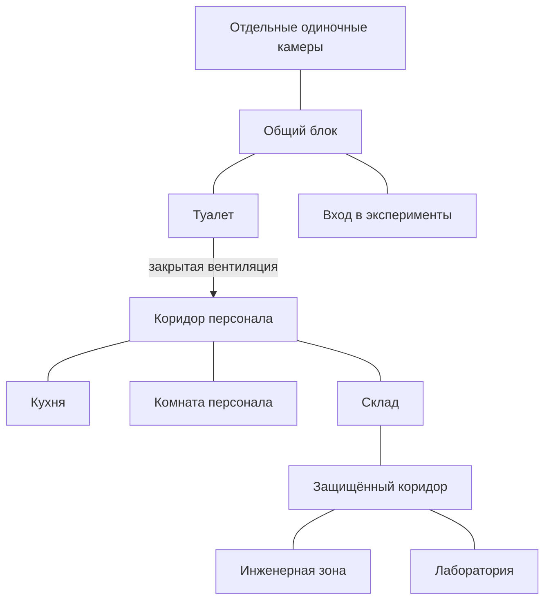

# Level design минимальной тюрьмы

Статус: описание реализованного односеточного прототипа
Ответственный за геймдизайн: автор игры  
Последнее обновление: 2026-06-21

Целевая архитектура атриума, санитарного крыла и нового порядка доступа
зафиксирована в `PRISON_WORLD_LEVEL_DESIGN.md`. Прямой маршрут через туалетную
вентиляцию ниже сохраняется как описание текущего `GameGrid`, а не как решение
для следующего blockout.

## Цель первого среза

Создать небольшой связный участок тюрьмы, который игрок постепенно изучает и
переосмысливает. В нём должны работать:

- распорядок и ограниченное время;
- публичные и закрытые маршруты;
- первый квест программиста на передатчик и найденный по пути глазной имплант;
- базовый стелс;
- возвращение в знакомые комнаты с новыми возможностями;
- первые улики о системе экспериментов и служебных маршрутах;
- один опциональный секрет, не нужный для сюжетного продвижения.

## Что берём из Resident Evil

Полицейский участок из **Resident Evil 2** работает не просто как набор
запертых дверей, а как пространственная головоломка:

1. Центральные безопасные или понятные зоны служат ориентирами.
2. Игрок рано видит несколько недоступных мест и запоминает их.
3. Один ключ или инструмент обычно открывает несколько возможностей.
4. Новые проходы создают петли и сокращают уже знакомые маршруты.
5. Возврат в знакомое пространство меняется из-за новых угроз, ресурсов или
   знаний.
6. Обязательные замки двигают сюжет, а дополнительные сейфы и тайники награждают
   любопытство.
7. Карта помогает планировать маршрут и помнить незаконченные дела.

Для нашей игры ресурсное давление Resident Evil заменяется прежде всего
ограниченным свободным временем, распорядком и риском повысить подозрение.

## Что не копируем

- Не запираем каждую дверь отдельным ключом. Это превращает исследование в
  доставку предметов.
- Не строим одну длинную цепочку без ответвлений. Игрок должен иметь хотя бы
  одну необязательную цель и выбор маршрута.
- Не размещаем абстрактные замки без объяснения. Пропуска, коды, вентиляция и
  посты охраны должны соответствовать устройству тюрьмы.
- Не заставляем игрока повторно проходить длинный коридор без нового решения,
  риска или информации.

## Функциональная схема

Семь минимальных функциональных зон из roadmap здесь разложены на физические
помещения. Например, «коридор администрации» включает кухню и служебный
коридор, а «хранилище имплантов» является частью инженерной зоны.

Схема показывает связи, а не физический масштаб.

## Принятая планировка прототипа

Текущее крыло намеренно построено линейно. Петли и короткие пути появятся после
добавления других крыльев и этажей.

- публичный блок: отдельные одиночные камеры, общая зона, туалет и вход в
  эксперименты;
- служебный блок: кухня, служебный коридор, склад, комната персонала,
  лаборатория и инженерная зона.

Публичный и служебный блоки полностью разделены стенами. Единственный скрытый
маршрут проходит через обычную дверь туалета и вентиляционную решётку прямо в
коридор персонала. Справа от вентиляции нет параллельного прохода. Кухня
является отдельным ответвлением коридора с единственной дверью.

Склад является обязательной переходной зоной между коридором персонала и
защищённым коридором. Из защищённого коридора игрок выбирает дверь лаборатории
или инженерной зоны.

Закрытые двери первого прототипа:

| Дверь | Требование |
|---|---|
| Двери одиночных камер | Открываются без ключа |
| Дверь туалета | Открывается без ключа |
| Вентиляционная решётка | Самодельная отвёртка |
| Склад | Лист приёмки кухни с подсказкой к коду |
| Выход из склада в защищённый коридор | Служебный пропуск |
| Инженерная зона | Служебный пропуск |
| Лаборатория | Пропуск высокого уровня, которого пока нет в прототипе |

Открытая дверь остаётся видимым объектом, но перестаёт блокировать проход и
обзор.

## Охрана и укрытия

В прототипе действуют два надзирателя:

- надзиратель служебного коридора проходит между входами в склад, комнату
  персонала и кухню;
- надзиратель защищённого коридора патрулирует между дверями лаборатории и
  инженерной зоны.

Надзиратели плавно ходят между концами своего коридора и останавливаются на
`5` секунд у каждого конца. Каждый надзиратель видит сектор примерно `90°`
перед собой на расстоянии до `7` клеток. Стены, закрытые двери и массивные
объекты блокируют обзор.

В правом верхнем углу находится мини-карта. Она показывает структуру текущего
крыла, положение игрока, надзирателей и их фактические области видимости.
(возможно заменить мини-карту на фонарики надзирателей)
Обнаружение происходит только при попадании игрока в показанную область.

Слева от выхода из вентиляции находится первое укрытие. Игрок может безопасно
наблюдать из-за него за паттерном надзирателя служебного коридора.

В качестве укрытий используются:

- столы и шкафы в общей зоне;
- тележки и шкафы в служебном коридоре;
- кухонные стойки;
- ящики на складе;
- лабораторные шкафы;
- инженерные консоли.

Укрытия одновременно формируют альтернативные траектории движения и создают
точки, из которых игрок может наблюдать маршрут охраны.

До обнаружения игрок может тихо устранить надзирателя: нужно встать на соседнюю
клетку строго за его спиной и нажать `F`. После обнаружения тихое устранение
недоступно. Когда действие доступно, над надзирателем появляется контекстная
подсказка `Скрытно устранить — F`.

Заметив игрока, надзиратель начинает преследование. Во время погони он движется
быстрее патрульной скорости, догоняет игрока и наносит урон вблизи. У игрока
есть полоска здоровья. При потере всего здоровья игрок теряет сознание и
текущая сцена перезапускается, включая состояния надзирателей.

Укрытия блокируют первоначальное обнаружение, но не прекращают уже начавшуюся
погоню.

## Предметы первого прототипа

| Предмет | Расположение | Функция |
|---|---|---|
| Самодельная отвёртка | Камера игрока | Открывает вентиляционную решётку |
| Копия листа приёмки кухни | Комната персонала | Даёт доступ к кодовому замку склада |
| Служебный пропуск | Склад | Открывает выход из склада и инженерную зону |
| Глазной имплант | Инженерная зона | Показывает скрытые провода, камеры и зоны сканирования |
| Передатчик | Инженерная зона | Позволяет программисту получать сведения о будущих экспериментах |
| Отчёты прошлых экспериментов | Лаборатория | Сюжетная улика для будущего доступа |

## Зоны

### Камера игрока

- **Статус:** публичная для игрока, надзиратели могут войти во время проверки.
- **Зачем приходит игрок:** начинает и заканчивает день, устанавливает импланты,
  работает с доской расследования.
- **NPC:** программист во вводном событии; надзиратель при проверке.
- **Связь с распорядком:** подъём, отбой, обязательное возвращение ночью.
- **Первое посещение:** доска пока почти пуста; станция установки имплантов
  доступна, но устанавливать нечего.
- **Открывается позже:** новые теории на доске; установка глазного импланта;
  последствия обыска камеры при высоком личном подозрении.
- **Риск:** низкий, но хранение запрещённых предметов опасно.
- **Соединена с:** общим блоком.

### Общий блок

- **Статус:** публичная.
- **Зачем приходит игрок:** разговоры, знакомства, наблюдение за заключёнными,
  выбор следующей активности.
- **NPC:** программист, заключённая 2, другие заключённые, патрульный
  надзиратель.
- **Связь с распорядком:** главная зона свободного времени и сбора перед
  экспериментом.
- **Первое посещение:** видны входы в коридор камер, туалет и эксперименты;
  программист сам подходит к игроку.
- **Открывается позже:** события отношений; скрытая камера становится заметна с
  глазным имплантом. Связь с другими крыльями относится к будущему расширению.
- **Риск:** низкий при обычном поведении; драка вызывает личное подозрение.
- **Соединена с:** коридором одиночных камер, туалетом и входом в эксперименты.

### Столовая

- **Статус:** публичная по расписанию, закрытая вне приёма пищи.
- **Зачем приходит игрок:** соблюдает распорядок, подслушивает разговоры,
  наблюдает за дверью персонала.
- **NPC:** заключённые, повара, надзиратели.
- **Связь с распорядком:** завтрак и другие обязательные приёмы пищи.
- **Первое посещение:** дверь персонала открывается только для поваров; через
  окно раздачи видна часть кухни.
- **Открывается позже:** возможность подслушать разговор о сменах охраны.
- **Риск:** низкий в разрешённое время; высокий вне расписания.
- **Соединена с:** общим блоком, позднее с коридором персонала.

### Туалет

- **Статус:** публичная.
- **Зачем приходит игрок:** находит первый скрытый маршрут в служебную часть.
- **NPC:** заключённые заходят ненадолго; надзиратели проверяют при подозрении.
- **Связь с распорядком:** доступен в свободное время.
- **Первое посещение:** повреждённая вентиляционная решётка и звук кухни за
  стеной.
- **Открывается позже:** вентиляция становится проходом после получения
  самодельной отвёртки от программиста; при тревоге решётку могут заменить.
- **Риск:** средний: долгое отсутствие игрока заметно, а открытая решётка
  повышает подозрение зоны.
- **Соединена с:** общим блоком, вентиляцией к коридору персонала.

### Вход в эксперименты

- **Статус:** контролируемая публичная зона.
- **Зачем приходит игрок:** переходит в случайно выбранный эксперимент.
- **NPC:** назначенные участники и надзиратели.
- **Связь с распорядком:** открывается только к назначенному времени.
- **Первое посещение:** демонстрирует, что эксперимент является частью
  тюремного распорядка, а не отдельным меню.
- **Открывается позже:** разные реакции NPC перед играми; сведения о следующем
  эксперименте.
- **Риск:** опоздание и попытка пройти без вызова.
- **Соединена с:** общим блоком.

### Кухня

- **Статус:** закрытая для заключённых.
- **Зачем приходит игрок:** исследует отдельное ответвление служебного коридора,
  находит сведения о работе персонала и ресурсы для отвлечения.
- **NPC:** повара по расписанию.
- **Связь с распорядком:** занята перед приёмами пищи, почти пуста после них.
- **Первое посещение:** единственная дверь в коридор персонала; список смен,
  показывающий безопасное окно.
- **Открывается позже:** путь обратно через дверь персонала; интерактивные
  объекты для подарков или отвлечения.
- **Риск:** средний или высокий в зависимости от времени.
- **Соединена с:** коридором персонала одной дверью.

### Коридор персонала

- **Статус:** закрытая.
- **Зачем приходит игрок:** проходит первый охраняемый отрезок и попадает к
  комнате персонала и складу.
- **NPC:** повара, инженеры, лаборанты, надзиратель на маршруте.
- **Связь с распорядком:** состав NPC и безопасные окна меняются по времени.
- **Первое посещение:** игрок видит двери комнаты персонала и склада.
- **Открывается позже:** камеры и зоны сканирования становятся видны с глазным
  имплантом.
- **Риск:** высокий; обнаружение повышает подозрение всей служебной зоны.
- **Соединена с:** кухней, комнатой персонала и складом.

### Спальня поваров — будущее расширение

- **Статус:** закрытая, но обычно не охраняется.
- **Зачем приходит игрок:** ищет личные сведения и необязательный секрет.
- **NPC:** повара во время отдыха.
- **Связь с распорядком:** безопаснее во время кухонной смены.
- **Первое посещение:** личные вещи, любовные записки с намёком на тихое место в
  саду.
- **Открывается позже:** тайный лаз в сад после сопоставления записок и следов
  у стены.
- **Риск:** средний; повар может заметить пропажу или беспорядок.
- **Соединена с:** коридором персонала, тайным лазом с садом.

### Склад

- **Статус:** закрытая кодовым замком.
- **Зачем приходит игрок:** получает служебный пропуск для проникновения в
  инженерную зону.
- **NPC:** кладовщик и повара по расписанию.
- **Связь с распорядком:** открыт во время приёмки поставок.
- **Первое посещение:** дверь с кодовой панелью; код можно понять по кухонному
  листу приёмки и маркировке ящиков.
- **Открывается позже:** служебный пропуск; расходники для отвлечения.
- **Риск:** средний; пропажа предметов повышает подозрение склада.
- **Соединена с:** коридором персонала и защищённым коридором.

### Инженерная зона и хранилище имплантов

- **Статус:** особо закрытая, охраняемая.
- **Зачем приходит игрок:** забирает передатчик для программиста и случайно
  получает глазной имплант.
- **NPC:** инженеры и надзиратель.
- **Связь с распорядком:** охрана и рабочие меняют позиции по сменам.
- **Первое посещение:** закрытая дверь, пост охраны, шум оборудования; через
  окно видны контейнеры имплантов.
- **Открывается позже:** после входа дверь блокируется. Глазной имплант
  показывает скрытые провода только рядом с игроком. Поворот инженерных
  консолей соединяет источник питания с механизмом тайного прохода.
- **Планировка головоломки:** источник находится у входа, приёмник — у дальней
  стены, а цепь изгибается через семь поворачиваемых узлов. Ящики формируют
  обходной маршрут и не дают увидеть всю комнату из одной точки.
- **Риск:** очень высокий; игрок не может вернуться через вход и обязан найти
  другой выход. Ошибочные повороты не наказываются.
- **Соединена с:** защищённым коридором; после решения головоломки открывается
  скрытый технический проход обратно на склад.

### Лаборатория

- **Статус:** особо закрытая, охраняемая.
- **Зачем приходит игрок:** находит отчёты о прошлых экспериментах.
- **NPC:** лаборанты, аналитики и надзиратель.
- **Связь с распорядком:** безопасное окно возможно во время эксперимента, когда
  часть персонала занята наблюдением.
- **Первое посещение:** терминалы и бумажные отчёты дают ранние улики о целях
  администрации.
- **Открывается позже:** новые отчёты после проведённых экспериментов.
- **Риск:** очень высокий; обнаружение может вызвать личное подозрение и
  усиление охраны.
- **Соединена с:** защищённым коридором.

### Сад между крыльями — будущее расширение

- **Статус:** закрытая зона персонала, будущий узел между крыльями.
- **Зачем приходит игрок:** продвигает route заключённой 2, подслушивает
  разговоры персонала и позднее открывает новые маршруты между крыльями.
- **NPC:** надзиратели, повара, инженеры и другой обслуживающий персонал. Состав
  зависит от времени и событий.
- **Связь с распорядком:** персонал выходит туда в свободные окна, например
  покурить или поговорить вне формального маршрута.
- **Первое посещение:** подтверждает, что заключённая получает знания о тюрьме
  через наблюдение за персоналом и личные связи.
- **Открывается позже:** через route заключённой 2 игрок может попасть туда с её
  помощью; позднее можно открыть альтернативный маршрут в блок C без её ключа.
- **Риск:** высокий, потому что это закрытая зона. При дружбе с заключённой 2
  риск ниже: она знает расписание персонала и может привести игрока в безопасное
  окно. Маскировочный имплант дополнительно упрощает пребывание в зоне.
- **Соединена с:** служебными маршрутами персонала первого и второго крыла;
  позднее — с альтернативным маршрутом в блок C.
- **Первая награда:** знание, что персонал регулярно использует сад для
  неформальных разговоров. Это делает сад повторяемым источником слухов для
  разных routes.

## Реализованная цепочка текущего прототипа

Цепочка должна обучить игрока замечать недоступные места, планировать время и
возвращаться с новым знанием.

1. В общем блоке программист просит дружить и рассказывает о скрытых камерах.
2. Игрок получает цель украсть передатчик и самодельную отвёртку.
3. В туалете игрок замечает повреждённую вентиляцию и открывает решётку
   отвёрткой.
4. Через вентиляцию игрок попадает прямо в служебный коридор и наблюдает маршрут
   надзирателя. Кухня остаётся отдельным ответвлением.
5. В коридоре игрок видит комнату персонала и закрытый вход в склад.
6. В комнате персонала игрок находит копию листа приёмки и по маркировке ящиков
   определяет код склада.
7. На складе игрок получает служебный пропуск и открывает выход в защищённый
   коридор.
8. В защищённом коридоре игрок видит двери лаборатории и инженерной зоны.
   Пропуск открывает инженерную зону, где игрок находит передатчик и глазной
   имплант.
9. Вход блокируется. С помощью импланта игрок решает загадку со скрытыми
   проводами и возвращается через технический проход.
10. После установки импланта знакомые зоны показывают камеры и их зоны
    сканирования.
11. Игрок возвращает передатчик программисту и узнаёт, что полный взлом системы
    не удался.
12. На доске расследования игрок соединяет систему подбора экспериментов и
    передатчик, открывая практическое преимущество: программист может заранее
    сообщать, какой имплант будет наградой за ближайший эксперимент.

## Опциональная цепочка будущего расширения

1. Игрок узнаёт через route заключённой 2, что старый вход в сад закрыли, а
   новый контролируется ключом.
2. При доверии заключённая может привести игрока в сад в безопасное окно.
3. В саду игрок понимает, что персонал регулярно выходит туда для неформальных
   разговоров.
4. Подслушанные разговоры дают слухи, которые могут запускать или продвигать
   routes разных персонажей.
5. Позднее игрок может открыть альтернативный маршрут в блок C без ключа
   заключённой.

Эта цепочка не входит в текущее линейное крыло и будет добавлена вместе с
расширением карты.

## Замки и награды текущего прототипа

| Препятствие | Игрок видит его | Требование | Где получает | Результат |
|---|---|---|---|---|
| Решётка туалета | В начале | Самодельная отвёртка | Программист | Первый вход в служебную часть |
| Код склада | При первом входе в служебный коридор | Сопоставить лист приёмки и ящики | Комната персонала и коридор | Служебный пропуск |
| Выход из склада | После входа на склад | Служебный пропуск | Склад | Защищённый коридор |
| Дверь инженерной зоны | В защищённом коридоре | Служебный пропуск | Склад | Маршрут к глазному импланту |
| Дверь лаборатории | В защищённом коридоре | Более поздний пропуск | Вне первого обязательного среза | Отчёты об экспериментах |
| Вход в сад | Будущее расширение | Доверие заключённой 2 или альтернативный маршрут | Route заключённой 2 | Информационный узел, слухи персонала и путь к блоку C |

## План камер

Камеры должны создавать читаемую систему наблюдения, а не равномерно заполнять
каждую комнату.

- В публичных зонах камеры следят за входами и массовыми скоплениями.
- В закрытых зонах камеры прикрывают основные двери и ценные объекты.
- В каждой ранней стелс-зоне должен существовать объяснимый слепой участок.
- До установки глазного импланта расположение камер можно предполагать по
  поведению персонала и следам креплений, но нельзя видеть их зоны сканирования.
- После проникновения охрана усиливает именно затронутую зону: меняет угол
  камеры, добавляет камеру или закрывает слепой участок.

## Маршруты и ориентиры

Игрок должен отличать зоны по функции, силуэту, цвету и звуку ещё до появления
подписей:

| Зона | Ориентир |
|---|---|
| Общий блок | Шум голосов, большой открытый центр |
| Столовая и кухня | Тёплый свет, пар, металлический звон |
| Коридор персонала | Белая служебная полоса на полу |
| Инженерная зона | Жёлтая маркировка, гул оборудования |
| Лаборатория | Холодный свет, стекло, тихая вентиляция |
| Сад | Растения, естественный свет, звук воды |

В первом срезе игрок осваивает два вида маршрута:

- безопасный публичный маршрут по распорядку;
- рискованный линейный служебный маршрут через вентиляцию, коридор персонала и
  склад.

## Изменение пространства при возвращении

Каждый обязательный возврат должен иметь новую ценность:

- после разговора с программистом игрок начинает искать камеры;
- после списка смен тот же коридор становится планируемым маршрутом;
- после установки глазного импланта знакомые комнаты раскрывают скрытые зоны
  наблюдения;
- после кражи импланта инженерная зона усиливает охрану;
- после теории данные о награде эксперимента превращают следующий эксперимент в
  осознанную цель, а не случайное обязательное событие.

## Границы первого прототипа

В первом playable slice реализуются:

- камера, общий блок, столовая, туалет;
- вентиляция, кухня, коридор персонала;
- склад и инженерная зона;
- черновой сад и блок C как тестовые зоны второго дня;
- два маршрута надзирателей;
- кровать, отбой и смена дня;
- глазной имплант, передатчик, активные слоты имплантов и первая теория.

Спальня поваров и лаборатория сначала могут существовать как закрытые двери с
понятными намёками. Геометрия сада и блока C в прототипе черновая: команда level
design позднее может заменить планировку, сохранив функции зоны.

## Открытые решения

- Должен ли служебный пропуск быть постоянным предметом или его использование
  оставляет запись и повышает подозрение.
- Может ли игрок украсть имплант без повышения подозрения.
- Как карта отмечает увиденные замки, найденные подсказки и незаконченные дела.
- Останавливается ли время при работе с кодами и доской расследования.
- Какие конкретные слухи в саду привязаны к routes разных заключённых.

## Временные допущения прототипа

- Геометрия блока C, архива данных и релейной комнаты является тестовой. Для
  route программиста важна функциональная цепочка из трёх скрытных проникновений
  с технологическими загадками, а не финальное расположение этих помещений.
- Текущий доступ к тестовому крылу через дверь сада/блока C используется только
  чтобы route программиста можно было проверить независимо от route заключённой
  2. В финальном level design открытие сада не должно быть наградой программиста:
  сад остаётся зоной заключённой 2, слухов персонала и маршрутов побега.
- В целевом blockout отвёртка открывает ревизионную панель хозяйственной части,
  кухня сначала является закрытым карманом, а её служебная дверь впервые
  открывается с обратной стороны. Гарантированный обратный вход появляется
  через предэкспериментальный шлюз после первого эксперимента.

## Материалы для изучения

- [The Level Design of Resident Evil 2: Police Station](https://horror.dreamdawn.com/?p=81213)
  — разбор связности, замков, возвратов и изменения маршрутов в участке.
- [Resident Evil 2 remake maps](https://www.ign.com/wikis/re2-remake/Maps_and_Item_Locations)
  — карты полезны для самостоятельного разбора петель, тупиков и коротких путей.
- [Boss Keys: The World Design of Resident Evil](https://www.youtube.com/watch?v=QhWdBhc3Wjc)
  — видео о структуре мира, ключах и возвращении в знакомые зоны в серии.
