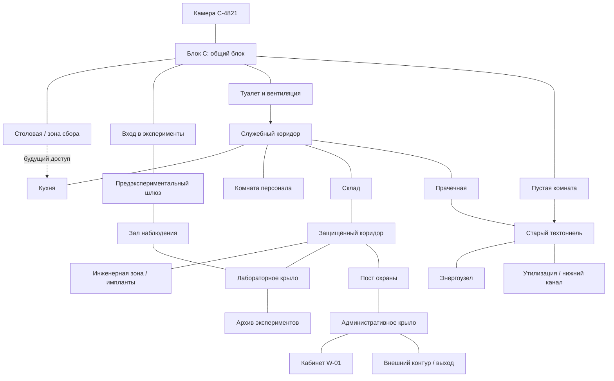

# Level Design всей тюрьмы

Статус: рабочая макроархитектура  
Последнее обновление: 2026-06-14

## Назначение

Документ декомпозирует левел-дизайн всей экспериментальной тюрьмы: какие зоны
существуют, как они открываются, какие петли образуют, где проходят критические
пути и где остаётся опциональное исследование.

`PRISON_LEVEL_DESIGN.md` остаётся принятой схемой минимального блока C.
`LEVEL_DESIGN_PLAN.md` описывает первый практический узел для итерации. Этот
документ смотрит шире: как блок C станет частью большой тюрьмы, а не отдельной
комнатной цепочкой.

## Референсы и выводы

Используем референсы как принципы, а не как форму для копирования.

- `Recursive Unlocking: Analyzing Resident Evil’s Map Design with Data
  Visualization` — предметы, замки и загадки лучше группировать в локальные
  “горячие зоны”, чтобы игроку редко приходилось пересекать всю карту без
  нового смысла.
- `IGN: Resident Evil 2 Remake Maps and Item Locations` — карта должна быть
  инструментом памяти: какие комнаты видели, какие закрыты, где остались
  предметы, коды, сейфы или незаконченные задачи.
- `GMTK: The World Design of Dark Souls | Boss Keys` — мир должен давать
  радость узнавания через петли, короткие пути и возвращение в знакомый хаб с
  новой стороны.

Для нашей игры важная поправка: ресурсное давление создаётся не патронами, а
распорядком, подозрением, отношениями, состоянием NPC и риском экспериментов.

## Главная идея карты

Тюрьма должна ощущаться как машина, где публичная жизнь заключённых, бытовая
логистика, охрана, эксперименты, медицина и администрация физически связаны
между собой.

Игрок начинает в самом понятном слое — блоке C. Затем он постепенно видит, что:

1. Публичные маршруты существуют только для контроля заключённых.
2. Служебные маршруты объясняют, как тюрьма работает каждый день.
3. Охранные маршруты объясняют, как система подавляет нарушения.
4. Исследовательские маршруты объясняют, зачем тюрьма вообще существует.
5. Административные маршруты объясняют, кто принимает решения.
6. Старые и технические маршруты показывают, где система дала трещину.

Карта должна открываться не “ключами от дверей”, а слоями понимания:

- **инструмент** открывает физический обход;
- **пропуск** открывает официальный маршрут;
- **имплант** открывает скрытую информацию;
- **отношение NPC** открывает человеческий обход;
- **улика или теория** открывает смысл ранее пустой зоны;
- **подозрение** закрывает или усложняет уже знакомый путь.

## Макроструктура

Тюрьма строится вокруг центрального блока C и нескольких колец доступа.

Это функциональный граф, а не финальный план помещений. Физическая карта может
быть компактнее, но связи и порядок открытия должны сохраниться.

## Кольца доступа

### Кольцо 0: Личное пространство

- **Зоны:** камера C-4821, доска расследования, станция имплантов.
- **Функция:** отдых, теории, установка имплантов, последствия обысков.
- **Тон:** тесно, знакомо, небезопасно по смыслу.
- **Возвраты:** после каждого значимого открытия.

Камера не должна быть полностью безопасным “меню”. При высоком подозрении она
может стать местом обыска, пропажи предметов или давления через NPC.

### Кольцо 1: Публичный блок C

- **Зоны:** общий блок, камеры заключённых, столовая, туалет, вход в
  эксперименты, пустая комната.
- **Функция:** отношения, распорядок, первые наблюдения, социальные события.
- **Риск:** низкий при соблюдении правил, средний при драке, слежке или
  опоздании.
- **Ключевой контраст:** игрок свободен двигаться, но не свободен выбирать
  смысл своего дня.

Это основной хаб ранней игры. Он должен иметь несколько видимых, но пока
непонятных обещаний: пустая комната, дверь персонала, вход в эксперименты,
камеры, недоступные верхние проходы или мостки.

### Кольцо 2: Служебное кольцо

- **Зоны:** кухня, служебный коридор, комната персонала, склад, прачечная.
- **Функция:** первый запретный слой, бытовая логистика, первые коды и
  пропуска.
- **Риск:** средний-высокий.
- **Игровая роль:** учит стелсу без перегруза сложными системами.

Служебное кольцо должно часто проходить рядом с публичными зонами, но через
окна, решётки, шум и закрытые двери показывать, что заключённые видят только
малую часть тюрьмы.

### Кольцо 3: Охранное кольцо

- **Зоны:** защищённый коридор, пост охраны, оружейная, камеры наблюдения,
  КПП, комнаты допроса.
- **Функция:** усиление риска, реакция на подозрение, контроль маршрутов.
- **Риск:** высокий.
- **Игровая роль:** превращает карту из набора комнат в систему наблюдения.

Охранное кольцо должно открываться частями. Игрок сначала проходит через него
как нарушитель, позже может получить ограниченный официальный доступ или
временное окно.

### Кольцо 4: Исследовательское кольцо

- **Зоны:** инженерная зона, хранилище имплантов, лаборатории, архив
  экспериментов, медицинский блок, зал наблюдения.
- **Функция:** главные ответы о тюрьме и самые сильные награды.
- **Риск:** очень высокий.
- **Игровая роль:** связывает эксперименты с глобальной картой.

Это не просто “финальная зона”. Игрок должен рано видеть её фрагменты: через
стекло, камеры, слухи, доставочные документы, лабораторные контейнеры и следы
после экспериментов.

### Кольцо 5: Административное кольцо

- **Зоны:** офисы аналитиков, кабинет W-01, серверная решений, внешний контур,
  зона транспорта.
- **Функция:** поздняя игра, системная правда, варианты финала.
- **Риск:** максимальный.
- **Игровая роль:** игрок больше не просто крадёт предметы, а вмешивается в
  правила системы.

Административное кольцо должно быть визуально чище и холоднее остальных зон.
Чем ближе игрок к центру власти, тем меньше грязи и тем больше безличного
порядка.

### Нижний технический слой

- **Зоны:** старые техтоннели, энергоузел, утилизация, нижний канал, забытая
  изоляция.
- **Функция:** короткие пути, секреты, альтернативные маршруты, последствия
  старых экспериментов.
- **Риск:** непредсказуемый, не всегда охранный.
- **Игровая роль:** даёт Dark Souls-style петли обратно в знакомые места.

Нижний слой должен быть не “канализацией ради канализации”, а пространством, где
видно прошлое тюрьмы: закрашенные номера блоков, старые камеры, аварийные
выключатели, заброшенные наблюдательные точки.

## Порядок открытия тюрьмы

### Фаза 1: Блок C как понятный хаб

- **Критический путь:** камера -> общий блок -> программист -> туалет.
- **Открывается:** вентиляция, первый разговор о скрытых камерах.
- **Опционально:** разговоры с заключёнными, наблюдение за пустой комнатой без
  понимания её значения, столовая как социальная сцена.
- **Пик:** решение нарушить правило и открыть вентиляцию.
- **Проверка:** игрок понимает, где публичное, где закрытое, и почему ему
  нужен имплант.

### Фаза 2: Служебное кольцо и первый стелс

- **Критический путь:** вентиляция -> служебный коридор -> комната персонала ->
  склад -> защищённый коридор.
- **Открывается:** лист приёмки, склад, служебный пропуск.
- **Опционально:** кухня, ресурс отвлечения, заметка о сменах.
- **Пик:** первый патруль в служебном коридоре.
- **Проверка:** игрок может объяснить, почему был замечен или почему прошёл
  чисто.

### Фаза 3: Инженерка и глазной имплант

- **Критический путь:** защищённый коридор -> инженерная зона -> глазной
  имплант -> возврат в камеру.
- **Открывается:** видимость скрытых камер и зон сканирования.
- **Опционально:** осмотр контейнеров других имплантов, следы предыдущих
  заключённых.
- **Пик:** второй патруль и кража импланта.
- **Проверка:** возвращение по знакомому маршруту ощущается иначе.

### Фаза 4: Пустая комната и старый техтоннель

- **Критический путь:** глазной имплант -> скрытая камера у пустой комнаты ->
  теория на доске -> исследование комнаты -> старый техтоннель.
- **Открывается:** первая большая петля вне принятого маршрута.
- **Опционально:** скрытая запись камеры, следы ремонтной бригады, тайник
  заключённого.
- **Пик:** игрок понимает, что тюрьма наблюдала не за комнатой, а за входом в
  скрытый маршрут.
- **Проверка:** теория на доске меняет навигацию, а не только журнал заданий.

### Фаза 5: Технический слой и короткие пути

- **Критический путь:** старый техтоннель -> прачечная или энергоузел ->
  служебное кольцо с другой стороны.
- **Открывается:** первый shortcut в публичный блок или служебное кольцо.
- **Опционально:** утилизация, нижний канал, старая изоляция.
- **Пик:** выбор между быстрым опасным проходом и длинным контролируемым
  маршрутом.
- **Проверка:** игрок получает удовольствие от узнавания старого места с новой
  стороны.

### Фаза 6: Лабораторное крыло

- **Критический путь:** новый доступ -> лаборатория -> архив экспериментов ->
  связь экспериментов с NPC.
- **Открывается:** отчёты, медицинский блок, зал наблюдения.
- **Опционально:** личные дела заключённых, записи проваленных экспериментов,
  лекарство или предмет для NPC.
- **Пик:** игрок видит, что эксперименты проектировались под социальные
  реакции, а не только под выживание.
- **Проверка:** найденные улики меняют отношение к следующим экспериментам.

### Фаза 7: Охранное и административное кольцо

- **Критический путь:** пост охраны -> серверная или офис аналитиков ->
  административный лифт -> кабинет W-01.
- **Открывается:** поздние способы вмешательства в расписание, охрану или
  экспериментальный пул.
- **Опционально:** оружейная, комнаты допроса, личные компроматы персонала.
- **Пик:** игрок выбирает, использовать систему ради себя или сломать её ценой
  риска для других.
- **Проверка:** финальные маршруты зависят от накопленных отношений, имплантов,
  подозрения и теорий.

### Фаза 8: Внешний контур и финальные маршруты

- **Критический путь:** внешний контур -> транспортный шлюз или контрольный
  центр.
- **Открывается:** варианты концовок.
- **Опционально:** возвращение за NPC, публичное раскрытие правды, саботаж
  эксперимента.
- **Пик:** финальный выбор выражается маршрутом и действиями, а не отдельной
  кнопкой “добро/зло”.
- **Проверка:** игрок понимает цену выбранного выхода.

## Основные зоны

### Блок C

- **Роль:** главный ранний хаб и эмоциональная база.
- **Критический путь:** камера, общий блок, туалет, вход в эксперименты.
- **Опционально:** разговоры, слежка за заключённой 2, пустая комната,
  небольшие тайники.
- **Петли:** поздний shortcut из технического слоя должен возвращать игрока в
  блок C с неожиданной стороны.
- **История:** заключённые живут под лозунгами и камерами, но пытаются создать
  личные микропространства.

### Столовая

- **Роль:** публичный распорядок и социальная сцена.
- **Критический путь:** обязательные сборы, слухи, наблюдение за дверью кухни.
- **Опционально:** подслушивание, обмен предметов, конфликт NPC.
- **Петли:** поздний доступ через кухню превращает столовую из публичной сцены
  в маску для служебного маршрута.
- **История:** питание, очереди и разметка показывают дисциплину системы.

### Служебное кольцо

- **Роль:** первый запретный маршрут.
- **Критический путь:** вентиляция, коридор, комната персонала, склад.
- **Опционально:** кухня, прачечная, сменные графики, расходники.
- **Петли:** кухня позднее может стать легальным или полулегальным проходом из
  столовой.
- **История:** тюрьма выглядит чудовищной, но работает через бытовую рутину.

### Защищённый коридор

- **Роль:** первый “порог власти”.
- **Критический путь:** переход к инженерке.
- **Опционально:** лаборатория как недоступное обещание, охранная дверь,
  наблюдение за патрулями.
- **Петли:** поздний доступ из поста охраны должен открыть короткий путь мимо
  раннего склада.
- **История:** предупреждающие линии, чистый металл, камеры и таблички доступа.

### Инженерная зона

- **Роль:** импланты как физическая инфраструктура.
- **Критический путь:** кража глазного импланта.
- **Опционально:** сведения о других имплантах, контейнеры, ремонтные журналы.
- **Петли:** после энергоузла игрок может попасть к инженерке через технический
  слой.
- **История:** здесь тело заключённого становится оборудованием.

### Пустая комната

- **Роль:** первая пространственная загадка расследования.
- **Критический путь:** скрытая камера -> теория -> тайный вход.
- **Опционально:** ложные следы, следы регулярной уборки, странная разметка
  пола.
- **Петли:** тайный вход ведёт в старый техтоннель.
- **История:** комната выглядит пустой только для того, кто не знает, куда
  смотреть.

### Технический слой

- **Роль:** система под системой.
- **Критический путь:** первая большая петля, энергоузел, альтернативный выход.
- **Опционально:** утилизация, старая изоляция, тайники, опасные обходы.
- **Петли:** должен возвращать в блок C, служебное кольцо и лабораторное крыло.
- **История:** старые слои показывают, что тюрьму перестраивали под новые
  эксперименты.

### Лабораторное крыло

- **Роль:** раскрытие назначения тюрьмы.
- **Критический путь:** отчёты экспериментов, архив, зал наблюдения.
- **Опционально:** медицинские ресурсы, личные дела NPC, записи провалов.
- **Петли:** зал наблюдения связывает лабораторию с входом в эксперименты.
- **История:** здесь моральная тема становится доказательством, а не догадкой.

### Медицинский блок

- **Роль:** последствия экспериментов и цена тела.
- **Критический путь:** поздние улики о погибших или спасённых NPC.
- **Опционально:** лечение, рискованная помощь другому, украденные препараты.
- **Петли:** связан с лабораторией, предэкспериментальным шлюзом и техтоннелем.
- **История:** стерильность, ремни, контейнеры и списки “годен/не годен”.

### Охранное кольцо

- **Роль:** реакция системы.
- **Критический путь:** пост охраны, контроль камер, доступ в администрацию.
- **Опционально:** оружейная, комнаты допроса, компромат на персонал.
- **Петли:** отключение/перенастройка камер открывает новые безопасные окна в
  старых зонах.
- **История:** охрана тоже является частью эксперимента: номера, протоколы,
  безличные смены.

### Административное крыло

- **Роль:** поздняя правда и финальные решения.
- **Критический путь:** офис аналитиков, серверная решений, кабинет W-01.
- **Опционально:** личные файлы, записи совещаний, данные о выборе заключённых.
- **Петли:** административный лифт может соединить верхний слой с внешним
  контуром и блоком C.
- **История:** чем выше власть, тем меньше видимого насилия и больше таблиц.

### Внешний контур

- **Роль:** финальная зона побега или раскрытия.
- **Критический путь:** транспортный шлюз, ворота, контрольный центр.
- **Опционально:** возвращение к NPC, саботаж, публичная трансляция.
- **Петли:** финальный маршрут может физически провести игрока через ранние
  зоны, но с изменённой угрозой.
- **История:** свобода видна, но система заставляет выбрать, кто заплатит за
  выход.

## Горячие зоны

Чтобы избежать усталого бэктрекинга, каждая глава должна иметь локальный
“горячий узел”: несколько связанных задач рядом.

| Глава | Горячая зона | Содержит |
|---|---|---|
| Ранний блок C | Туалет + вентиляция + общий блок | отвёртка, скрытый маршрут, первый риск |
| Первый стелс | Служебный коридор + комната персонала + склад | патруль, лист, код, пропуск |
| Имплант | Защищённый коридор + инженерка | патруль, хранилище, глазной имплант |
| Первая теория | Пустая комната + камера + доска | скрытое наблюдение, теория, тайный вход |
| Первая петля | Техтоннель + прачечная + блок C | shortcut, старый слой, новая сторона хаба |
| Лаборатория | Архив + медблок + зал наблюдения | отчёты, тела, связь с экспериментами |
| Поздняя игра | Пост охраны + администрация + серверная | контроль системы, финальные маршруты |

Правило: если игрок получил ключевое знание или предмет, ближайшее важное
применение должно находиться в той же горячей зоне или в хорошо запомнившемся
месте из предыдущей фазы.

## Короткие пути

Короткий путь должен открываться после риска, а не до него.

1. **Кухня -> столовая.** Поздний бытовой shortcut, который делает служебное
   кольцо частью публичного блока.
2. **Пустая комната -> техтоннель.** Первый большой “ага-момент”.
3. **Техтоннель -> прачечная.** Альтернативный вход в служебное кольцо.
4. **Энергоузел -> инженерка.** Возврат к имплантам без повторения склада.
5. **Пост охраны -> защищённый коридор.** Поздний контроль раннего стелс-пика.
6. **Зал наблюдения -> вход в эксперименты.** Связь экспериментов с картой.
7. **Административный лифт -> блок C.** Финальное возвращение к началу.

Каждый shortcut должен иметь три свойства:

- игрок видел закрытую сторону раньше;
- открытие сокращает уже знакомый маршрут;
- после открытия старый маршрут не становится бессмысленным, потому что может
  быть безопаснее, социально полезнее или менее подозрительным.

## Опциональное исследование

Опциональные зоны должны давать не только предметы, но и новые способы думать о
системе.

| Опциональная зона | Награда | Риск |
|---|---|---|
| Кухня | смены, отвлечение, социальный предмет | время и служебное подозрение |
| Прачечная | shortcut, одежда/маскировка в будущем | персонал и камеры |
| Старая изоляция | улика о прошлых заключённых | потеря времени, неизвестная угроза |
| Утилизация | способ избавиться от следов | опасный маршрут и моральная цена |
| Оружейная | силовое преимущество | резкий рост подозрения |
| Медблок | лечение или помощь NPC | камеры, этический выбор, пропажа ресурсов |
| Офисы аналитиков | правда о социальных тестах | поздняя охрана и системные последствия |

## Подозрение как изменение карты

Подозрение должно менять не только UI, но и географию риска.

- **Личное подозрение:** проверки камеры, слежка в публичном блоке, ухудшение
  реакции некоторых NPC.
- **Зональное подозрение:** новая камера, закрытая дверь, изменённый патруль,
  убранное укрытие, заблокированная вентиляция.
- **Сюжетное подозрение:** администрация начинает использовать отношения и
  эксперименты, чтобы давить на игрока.

Важно: усиление зоны должно создавать новую задачу, а не просто наказывать
игрока необратимым тупиком.

## Readability

Карта должна читаться слоями:

- **Публичное:** широкий проход, грязный бетон, шум, трафареты, столы, очереди.
- **Служебное:** жёлтая разметка, тележки, графики смен, кухонный шум, шкафчики.
- **Охранное:** чистые линии, камеры, турникеты, металл, красные/янтарные
  предупреждения.
- **Исследовательское:** стерильный свет, стекло, контейнеры, CRT, медицинские
  столы.
- **Административное:** симметрия, тишина, белее свет, документы, терминалы.
- **Старое техническое:** ржавчина, кабели, аварийный свет, закрашенные знаки,
  следы перестройки.

UI-маркеры должны подтверждать уже прочитанное окружение. Если игрок не может
понять путь без маркера, проблема в архитектурной подсказке.

## Метрики и ограничения реализации

Текущие метрики:

- `WorldMetrics.CellSize = 1`;
- персонаж примерно `1.55` клетки по высоте;
- игрок движется примерно `6.7` клетки/сек;
- базовый обзор надзирателя — около `7` клеток;
- минимальный обычный проход — `1` клетка;
- комфортный публичный проход — `3-5` клеток;
- стелс-коридор — `2-3` клетки с укрытиями и ясными sightlines.

Для будущей реализации нужно разделять:

- **логика:** зоны доступа, требования, патрули, подозрение, интерактивные
  объекты, переходы;
- **placement:** координаты комнат, укрытий, предметов, дверей, камер, света и
  декора.

Не стоит навсегда зашивать всю тюрьму в один `GameGrid.cs`. Когда блок C
стабилизируется, следующая техническая цель — вынести layout-данные в
конфиг/ScriptableObject/табличный формат, чтобы дизайнерские правки не
перемешивались с игровой логикой.

## Производственная декомпозиция

### Пакет 1: Макроархитектура

- утвердить кольца доступа;
- утвердить список крупных зон;
- зафиксировать порядок открытия;
- отметить будущие shortcuts.

Готово, когда команда одинаково понимает, где находится блок C относительно
служебного, лабораторного и административного слоёв.

### Пакет 2: Block C playable slice

- довести текущий маршрут до читаемого прохождения;
- проверить служебный коридор как первый стелс-узел;
- добавить пустую комнату как видимую загадку;
- подготовить место под будущий shortcut из техтоннеля.

Готово, когда игрок проходит первый день и понимает назначение каждой видимой
двери: сейчас доступна, позже откроется, опасна, загадочна.

### Пакет 3: Первая петля

- реализовать пустую комнату;
- открыть старый техтоннель;
- вывести его в прачечную или обратно в блок C;
- проверить, что shortcut даёт “ага-момент”, а не просто новый коридор.

Готово, когда игрок возвращается в знакомую зону с новой стороны и может
сформулировать, как карта стала меньше.

### Пакет 4: Лабораторный слой

- открыть лабораторию и архив;
- связать отчёты с экспериментами;
- добавить медицинский блок;
- создать route choices: безопаснее, быстрее, социально рискованнее.

Готово, когда эксперименты перестают ощущаться отдельными сценами и становятся
частью физической тюрьмы.

### Пакет 5: Охранный и административный слой

- открыть пост охраны;
- добавить управление камерами/дверями как позднюю силу;
- открыть офисы аналитиков и кабинет W-01;
- подготовить финальные маршруты.

Готово, когда игрок может влиять на систему, но каждое вмешательство имеет цену.

### Пакет 6: Финальный внешний контур

- спроектировать физический выход;
- связать концовки с маршрутами, NPC и уликами;
- провести финальный маршрут через переосмысленные ранние зоны.

Готово, когда финал ощущается следствием всего изученного пространства.

## Ближайший практический шаг

Следующий рабочий шаг остаётся маленьким:

`выход вентиляции -> служебный коридор -> комната персонала`.

Но теперь этот узел проектируется как первый фрагмент всей тюрьмы. Он должен
заложить язык, который потом повторится в больших слоях:

- видимый запрет;
- безопасная точка наблюдения;
- рискованный прямой путь;
- маленькая награда знанием;
- дверь или зона, которую игрок запомнит на будущее;
- шанс вернуться сюда позже с новым доступом.

