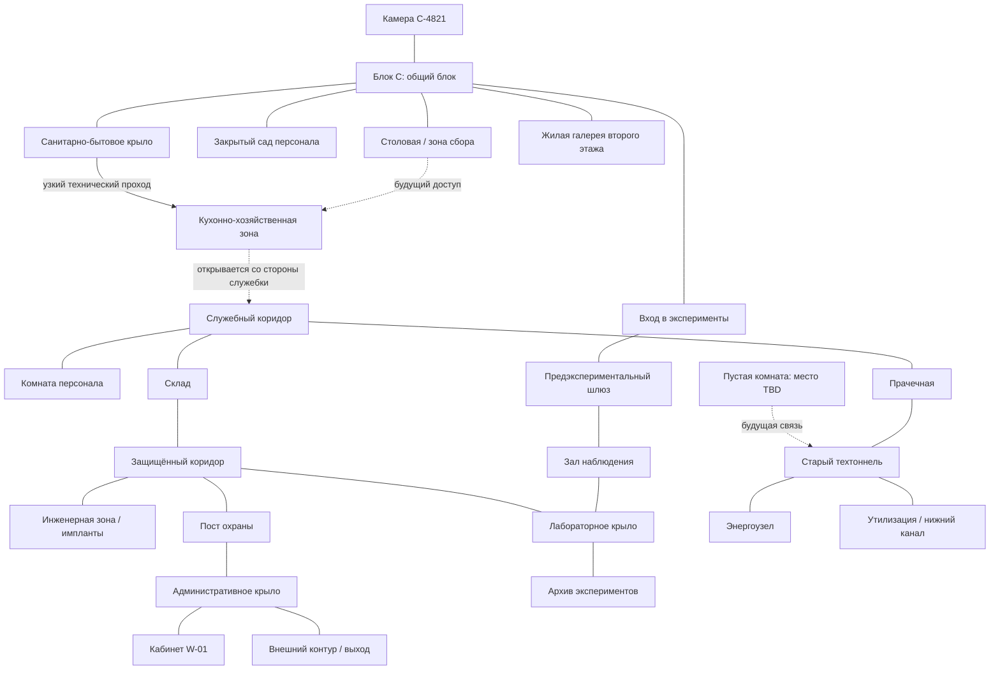
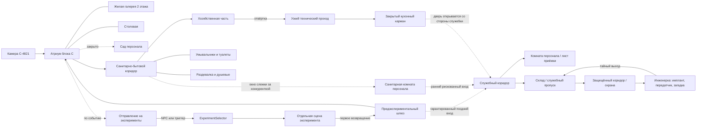

# Level Design всей тюрьмы

Статус: рабочая макроархитектура  
Последнее обновление: 2026-07-08

## Назначение

Документ декомпозирует левел-дизайн всей экспериментальной тюрьмы: какие зоны
существуют, как они открываются, какие петли образуют, где проходят критические
пути и где остаётся опциональное исследование.

`PRISON_LEVEL_DESIGN.md` описывает реализованный односеточный прототип блока C.
`LEVEL_DESIGN_PLAN.md` задаёт порядок следующего blockout. Этот документ
является источником правды для целевой архитектуры: как блок C станет частью
большой тюрьмы, а не отдельной комнатной цепочкой.

## Актуальная пометка по playable slice

На 2026-07-08 ревизионная панель/вентиляция остаётся обязательным ранним
проходом из санитарного крыла в моечную и кухонный карман. Лишним считается
только прямой проход из upper crossing в склад смены: его нет на SVG-карте и в
игре он должен быть закрыт стеной. Также удалён широкий вертикальный коридор
справа от вентиляции: вход в кухонный карман на этом участке идёт через узкую
вентиляцию. Поздняя технологическая цепочка программиста уходит на второй этаж
через техлестницу, которая соединяет два коридора, расположенные друг над
другом.

## Референсы и выводы

Используем референсы как принципы, а не как форму для копирования.

- `Recursive Unlocking: Analyzing Resident Evil’s Map Design with Data
  Visualization` — предметы, замки и загадки лучше группировать в локальные
  “горячие зоны”, чтобы игроку редко приходилось пересекать всю карту без
  нового смысла.
- `IGN: Resident Evil 2 Remake Maps and Item Locations` — карта должна быть
  инструментом памяти: какие комнаты видели, какие закрыты, где остались
  предметы, коды, сейфы или незаконченные задачи.
- `GMTK: The World Design of Dark Souls | Boss Keys` — мир должен давать
  радость узнавания через петли, короткие пути и возвращение в знакомый хаб с
  новой стороны.

Для нашей игры важная поправка: ресурсное давление создаётся не патронами, а
распорядком, подозрением, отношениями, состоянием NPC и риском экспериментов.

## Главная идея карты

Тюрьма должна ощущаться как машина, где публичная жизнь заключённых, бытовая
логистика, охрана, эксперименты, медицина и администрация физически связаны
между собой.

Игрок начинает в самом понятном слое — блоке C. Затем он постепенно видит, что:

1. Публичные маршруты существуют только для контроля заключённых.
2. Служебные маршруты объясняют, как тюрьма работает каждый день.
3. Охранные маршруты объясняют, как система подавляет нарушения.
4. Исследовательские маршруты объясняют, зачем тюрьма вообще существует.
5. Административные маршруты объясняют, кто принимает решения.
6. Старые и технические маршруты показывают, где система дала трещину.

Карта должна открываться не “ключами от дверей”, а слоями понимания:

- **инструмент** открывает физический обход;
- **пропуск** открывает официальный маршрут;
- **имплант** открывает скрытую информацию;
- **отношение NPC** открывает человеческий обход;
- **улика или теория** открывает смысл ранее пустой зоны;
- **подозрение** закрывает или усложняет уже знакомый путь.

## Макроструктура

Тюрьма строится вокруг центрального блока C и нескольких колец доступа.



Это функциональный граф, а не финальный план помещений. Физическая карта может
быть компактнее, но связи и порядок открытия должны сохраниться.

## Интеграция существующего vertical slice

Новая карта должна переиспользовать уже работающие механики и менять прежде
всего placement и порядок доступа. На этапе blockout не добавляем новые
идентификаторы NPC, имплантов или предметов.



### Размещение работающих механик

| Существующая механика | Новое место | Как используется |
|---|---|---|
| Старт игрока | Камера C-4821 на юго-западе атриума | Сохраняет знакомую точку каждого run |
| `ProgrammerNPC` и диалоги | Activity points атриума, второго этажа и столовой | Взаимодействие по `E` работает независимо от текущей точки NPC |
| Журнал задач | Глобальный UI по `J` | Не требует отдельного помещения |
| Самодельная отвёртка | Награда за принятие квеста программиста | Открывает сразу заметную, но привинченную панель узкого прохода в хозяйственной части |
| `NPC` входа в эксперимент | Комната отправления на эксперименты | При доступном событии запускает выбор эксперимента из пула |
| Отдельные сцены экспериментов | За северной комнатой функционально, не физически | Загружаются через `RunState`; первое возвращение проходит через предэкспериментальный шлюз |
| `PrisonDoor` с требованиями | Закрытые крылья, служебные двери, склад, инженерка | Переиспользуются без новых типов предметов |
| `GuardPatrol` | Первый обязательный патруль начинается за будущим выходом кухни | Публичный атриум и санитарный блок не становятся ранней боевой зоной |
| Лист приёмки кухни | Комната персонала | Сохраняет существующую подсказку к складу |
| Служебный пропуск | Склад | Открывает защищённый коридор и инженерную зону |
| Глазной имплант и передатчик | Инженерная зона | Сохраняют текущую кульминацию квеста программиста |
| Загадка со скрытыми проводами | Инженерная зона | После блокировки входа открывает технический выход на склад |

### Адаптация квеста программиста

Принятое рабочее решение — превратить существующий квест в длинную цепочку через
несколько крыльев, а не открывать весь путь до инженерки в санитарном блоке:

1. Игрок встречает программиста в одном из activity points и принимает квест на
   передатчик.
2. Программист выдаёт отвёртку; это сохраняет текущую награду и взаимодействие.
3. В хозяйственной части санитарного крыла игрок открывает ревизионную панель и
   впервые проникает в кухонный карман.
4. В кухне он исследует доступные помещения и видит закрытый служебный выход,
   который нельзя открыть в текущем крыле.
5. После первого пережитого эксперимента игрок возвращается через
   предэкспериментальный шлюз. Из него доступен гарантированный путь в
   служебный коридор, не зависящий от отношений или другого персонального
   квеста.
6. Рискованная ранняя альтернатива существует до эксперимента: во время слежки
   за Ракель игрок может проскользнуть за ней через санитарную комнату
   персонала. Если окно упущено, квест программиста не блокируется.
7. Из кухонного кармана игрок открывает служебную дверь кухни. После этого она
   становится постоянным двусторонним shortcut текущего run.
8. В служебном кольце продолжается существующий стелс-маршрут: патруль, комната персонала,
   лист приёмки и склад.
9. Служебный пропуск со склада открывает защищённый коридор и инженерку.
10. Игрок находит глазной имплант и передатчик, решает загадку со скрытыми
   проводами и выходит обратно на склад.
11. Возвращение к программисту завершает существующий квест и диалог о скрытом
   риске.

Такой порядок сохраняет весь реализованный контент, но кухонный карман становится
первым checkpoint, а не дверью сразу ко всей служебной части. Текущий общий текст
цели “проникнуть в инженерную зону” может работать без изменений, но для ясной
обратной связи позднее понадобятся дополнительные этапы журнала.

До первого открытия служебная дверь кухни не является отдельным входом в
кухонный карман: туда по-прежнему нужно попасть через ревизионную
панель/вентиляцию. После открытия из кухонной стороны дверь становится обычным
двусторонним shortcut между кухней и служебным кольцом. Для этого не требуется
новый предмет или идентификатор.

### Доступность квестов

Ни один персональный route не должен быть обязательным ключом для другого.
Связь между routes может дать ранний, более быстрый или безопасный путь, но у
каждой обязательной цели остаётся независимый гарантированный вход.

| Route | Обязательная цель | Гарантированный доступ | Опциональное преимущество | Защита от блокировки |
|---|---|---|---|---|
| Программист: передатчик | Служебное кольцо, склад, инженерка | Предэкспериментальный шлюз после первого эксперимента | Ранний вход вслед за Ракель | Пропущенная слежка не закрывает путь; дверь кухни открывается с обратной стороны |
| Программист: источник данных, архив, релейная | Собственное технологическое крыло за служебным кольцом | Ключ технологического крыла из инженерной зоны и последовательные этапы квеста | Глазной имплант раскрывает подсказки и локальные технические выходы | Эти комнаты не требуют входа в сад и не используют награду route Ракель |
| Ракель | Слежка, комната персонала, сад | Повторяемое утреннее окно через санитарную комнату персонала | Близкое следование даёт ранний вход в служебное кольцо | При провале окно повторяется следующим утром; сад не нужен для первого подслушивания |
| Главная тайна | Улики и доска расследования | Публичные разговоры, эксперименты и предметы активных routes | Закрытые зоны дают более сильные связи | Ни один ранний вывод не требует взаимоисключающих предметов или выбора NPC |
| Обязательный эксперимент | Комната отправления | Публичный периметр атриума | Обе лестницы и несколько маршрутов вокруг пустоты | От любой доступной ранней зоны вход достижим до конца окна `12:00-12:15` |

Сад остаётся наградой route Ракель и альтернативного исследования.
Тестовый runtime сейчас может открывать дверь сада для поздних задач
программиста, но это временное допущение прототипа, которое нельзя переносить в
финальный blockout.

### Что требует расширения кода

- многоэтажная карта или отдельные layout-слои для двух доступных этажей;
- маршруты NPC между activity points вместо случайного блуждания;
- расписание доступности комнаты отправления на эксперименты;
- возврат из первого эксперимента через предэкспериментальный шлюз вместо
  мгновенного появления в атриуме;
- короткое окно прохода вслед за Ракель через санитарную комнату
  персонала и повтор маршрута при неудаче;
- режим двери, которая до первого открытия взаимодействует только со стороны
  служебного коридора;
- размещение карты, комнат и патрулей вне одного жёстко заданного блока
  `GameGrid.InitializeGrid`;
- перенос координат инженерной загадки в данные конкретной зоны;
- дополнительные этапы журнала, если квест программиста становится
  многоступенчатым между несколькими крыльями.

Эти расширения не меняют контракт `RunState.BuildContext` / `SubmitResult` и не
требуют новых `NpcId`, `ImplantId` или `PrisonItemId` для первого blockout.

## Кольца доступа

### Кольцо 0: Личное пространство

- **Зоны:** камера C-4821, доска расследования, станция имплантов.
- **Функция:** отдых, теории, установка имплантов, последствия обысков.
- **Тон:** тесно, знакомо, небезопасно по смыслу.
- **Возвраты:** после каждого значимого открытия.

Камера не должна быть полностью безопасным “меню”.

### Кольцо 1: Публичный блок C

- **Зоны:** общий блок, камеры заключённых двух этажей, столовая,
  санитарно-бытовое крыло, вход в эксперименты и закрытый сад персонала.
- **Функция:** отношения, распорядок, первые наблюдения, социальные события.
- **Риск:** низкий при соблюдении правил, средний при драке, слежке или
  опоздании.
- **Ключевой контраст:** игрок свободен двигаться, но не свободен выбирать
  смысл своего дня.

Это основной хаб ранней игры. Он должен иметь несколько видимых, но пока
непонятных обещаний: сад персонала, служебные двери, вход в эксперименты и
закрытые крылья второго этажа. Пустая комната размещается позднее там, где она
лучше поддержит переосмысление уже знакомого маршрута.

### Кольцо 2: Служебное кольцо

- **Зоны:** кухня, служебный коридор, комната персонала, склад, прачечная.
- **Функция:** первый запретный слой, бытовая логистика, первые коды и
  пропуска.
- **Риск:** средний-высокий.
- **Игровая роль:** учит стелсу без перегруза сложными системами.

Служебное кольцо должно часто проходить рядом с публичными зонами, но через
окна, решётки, шум и закрытые двери показывать, что заключённые видят только
малую часть тюрьмы.

### Кольцо 3: Охранное кольцо

- **Зоны:** защищённый коридор, пост охраны, оружейная, камеры наблюдения,
  КПП, комнаты допроса.
- **Функция:** усиление риска, реакция на подозрение, контроль маршрутов.
- **Риск:** высокий.
- **Игровая роль:** превращает карту из набора комнат в систему наблюдения.

Охранное кольцо должно открываться частями. Игрок сначала проходит через него
как нарушитель, позже может получить ограниченный официальный доступ или
временное окно.

### Кольцо 4: Исследовательское кольцо

- **Зоны:** инженерная зона, хранилище имплантов, лаборатории, архив
  экспериментов, медицинский блок, зал наблюдения.
- **Функция:** главные ответы о тюрьме и самые сильные награды.
- **Риск:** очень высокий.
- **Игровая роль:** связывает эксперименты с глобальной картой.

Это не просто “финальная зона”. Игрок должен рано видеть её фрагменты: через
стекло, камеры, слухи, доставочные документы, лабораторные контейнеры и следы
после экспериментов.

### Кольцо 5: Административное кольцо

- **Зоны:** офисы аналитиков, кабинет W-01, серверная решений, внешний контур,
  зона транспорта.
- **Функция:** поздняя игра, системная правда, варианты финала.
- **Риск:** максимальный.
- **Игровая роль:** игрок больше не просто крадёт предметы, а вмешивается в
  правила системы.

Административное кольцо должно быть визуально чище и холоднее остальных зон.
Чем ближе игрок к центру власти, тем меньше грязи и тем больше безличного
порядка.

### Нижний технический слой

- **Зоны:** старые техтоннели, энергоузел, утилизация, нижний канал, забытая
  изоляция.
- **Функция:** короткие пути, секреты, альтернативные маршруты, последствия
  старых экспериментов.
- **Риск:** непредсказуемый, не всегда охранный.
- **Игровая роль:** даёт Dark Souls-style петли обратно в знакомые места.

Нижний слой должен быть не “канализацией ради канализации”, а пространством, где
видно прошлое тюрьмы: закрашенные номера блоков, старые камеры, аварийные
выключатели, заброшенные наблюдательные точки.

## Порядок открытия тюрьмы

### Принцип открытия

Игрок открывает тюрьму не как линейную цепочку комнат, а как повторяемую
структуру, которая постепенно становится понятнее. В начале он чувствует себя
маленьким внутри системы: вокруг много дверей, этажей, мостков, камер,
заключённых и правил, но почти ничего не объяснено напрямую.

Постоянный прогресс в rogue-lite структуре — это знание игрока:

- где находятся безопасные и опасные маршруты;
- какие двери пока являются обещанием будущего доступа;
- какие зоны можно проходить быстрее после практики;
- какие детали среды приобретают смысл после импланта, улики или разговора.

Новый run возвращает карту к базовому состоянию. Тюрьма не должна физически
помнить прошлые попытки игрока: никаких следов предыдущих забегов, старых
побегов, новых повреждений или постоянного наказания карты. Реакции системы
происходят внутри текущего run и сбрасываются при новом старте.

### Базовая форма

Главный хаб — атриум блока C. Он работает как тюремная версия центрального зала
из `Resident Evil 2`: понятное место, куда игрок постоянно возвращается, но не
уютная безопасная комната.

В плане это вытянутый прямоугольный многоэтажный зал. Восточная и западная
стороны длиннее южной и северной, а боковые крылья продолжают эту горизонтальную
структуру. Камеры заключённых расположены по периметру первого и верхних этажей,
но между группами камер оставлены проходы к лестницам, крыльям и режимным зонам.

Ориентация первого этажа:

- **юг:** камера C-4821 и соседние камеры заключённых;
- **север:** комната отправления на эксперименты; за ней публичная часть первого
  этажа заканчивается;
- **восток:** отдельный вход в протяжённое санитарно-бытовое крыло с собственными
  комнатами и коридорами;
- **запад:** отдельные входы в столовую и сад; это разные зоны, а не один общий
  западный маршрут;
- **центр:** общий блок для движения, общения и повседневных активностей NPC.

Служебные и охранные маршруты видны как части архитектуры, но открываются позже.
Они не должны занимать один из ранних публичных входов и конкурировать с
санитарно-бытовым крылом за роль первого исследуемого маршрута.

### Центральная система наблюдения

В центре атриума находится крупный визуальный ориентир по мотивам концепт-арта:
полностью подвешенная стеклянная капсула наблюдения. Она создаёт ощущение
постоянного контроля, но не является механикой, целью квеста или обязательной
точкой взаимодействия. Под капсулой сохраняется свободный проходимый пол.

Ориентир не должен мешать игровому процессу:

- не перекрывает основные направления движения;
- не создаёт ложного обещания немедленного взлома или проникновения;
- не закрывает игрока и NPC сплошным непрозрачным силуэтом;
- верхняя часть становится прозрачной или уходит на фоновый слой, когда может
  перекрыть персонажа;
- не имеет опоры, терминала, коллайдера или другого footprint на первом этаже.

### Этажи и видимость

Многоэтажность должна читаться с первой минуты, но верхние этажи не должны
перекрывать обзор первого. Галереи располагаются по периметру атриума и оставляют
центральный объём открытым. Ближняя к камере стена и нависающие конструкции
используют cutaway или прозрачность.

В первой версии атриум состоит из двух доступных этажей. На обоих этажах по
периметру расположены жилые камеры и общие галереи. Игрок может подняться на
второй этаж с начала игры, исследовать галерею и общаться с NPC, но входы в
отдельные крылья второго этажа закрыты и открываются значительно позже.

Камеры второго этажа, ограждения, лестницы и движущиеся силуэты NPC показывают,
что блок C продолжается вверх. Игровые маршруты этажей можно хранить на отдельных
слоях карты; одновременно отображается их архитектурный фасад и центральный
проём, а не несколько наложенных друг на друга игровых полов.

Две лестницы расположены вдоль восточной и западной сторон атриума. Они видны из
центральной части, соединяют этажи в кольцевой маршрут и не перекрывают входы в
боковые крылья. Наличие двух лестниц позволяет NPC и игроку выбирать направление
и не превращает вертикальное перемещение в один обязательный choke point.

Третий этаж и подвал остаются резервом будущего расширения. В них не планируются
жилые помещения: позже там могут появиться охранные, служебные, технические или
исследовательские зоны. До отдельного этапа они не считаются частью playable
структуры и не должны визуально обещать доступ, которого ещё нет в дизайне.

### Жилые камеры и масштаб

Первый этаж содержит `10–12` жилых камер, второй — `12–16`. В это количество
входят камера C-4821, камеры значимых персонажей и резерв под будущих NPC.
Отсутствие готового персонажа не является причиной убирать комнату из
архитектуры: незанятые или пока неиспользуемые камеры поддерживают масштаб блока
и позволяют добавлять жителей без перестройки атриума.

Камеры группируются вдоль непрерывного проходимого периметра, но не образуют
сплошную стену дверей. Маршрут расширяется у лестниц, столовой и
санитарно-бытового крыла. Между группами камер остаются:

- выходы к крыльям и режимным зонам;
- две лестницы;
- карманы для разговоров и ожидания;
- технические ниши и визуальные ориентиры;
- широкие участки галереи для встречного движения NPC.

Размерное предложение с распределением камер, координатами проёмов и маршрутами
зафиксировано в `BLOCK_C_BLOCKOUT_V02.md`. До первого Play Mode-прохода это
версия `v0.2`, которую можно локально менять без пересмотра макроструктуры.

Игрок может входить в камеры других заключённых. В обычных камерах нет
прогресс-критичных предметов, обязательных ресурсов или случайно спрятанных
ключей. Их функция — личное пространство NPC, место для разговоров, событий и
environmental storytelling. Важная камера должна становиться целью через
персонажа, наблюдение или конкретную улику, а не через привычку обыскивать все
одинаковые помещения.

Камера C-4821 находится на южной стороне, но смещена относительно центральной
оси. Из неё не видна напрямую комната отправления на эксперименты. Северный вход
становится читаемым после выхода в общий объём или обхода центральной системы
наблюдения, поэтому первый выход из камеры раскрывает масштаб атриума постепенно.

### Размер и время перемещения

Проход с южной стороны атриума к комнате отправления на эксперименты должен
занимать примерно `7–10` секунд обычного движения без остановок. Метрика включает
выход с жилой галереи, движение через общий блок и небольшой обход центрального
визуального ориентира.

Текущий blockout даёт около `59` четырёхнаправленных шагов по маршруту юг–север,
или примерно `8.8` секунды при скорости игрока `6.7` клетки/сек. Фактический
размер уточняется в Play Mode: важно сохранять интервал `7–10` секунд, а не число
клеток любой ценой.

### Функциональный blockout первого этажа v0.2

Размерная схема: `BLOCK_C_BLOCKOUT_V02.md`. Визуальный план:
`BLOCK_C_BLOCKOUT_F1_V02.svg`.

```text
                                  СЕВЕР
               ┌───────┬────────────────────┬───────┐
               │камера │ отправление в      │камера │
               │       │ эксперименты       │       │
┌──────────────┼───────┴────────────────────┴───────┼──────────────┐
│ закрытый сад │камера      северная галерея   камера│ санитарное  │
│ персонала    │                                      │ крыло       │
├──────────────┤      зона построения                  ├──────────────┤
│ камера       │                                      │ камера       │
│              │ лестница З      лестница В           │              │
├──────────────┤                                      ├──────────────┤
│ столовая     │ столы      свободный пол      спорт  │ санитарное  │
│              │       [капсула наблюдения сверху]    │ крыло       │
├──────────────┤                                      ├──────────────┤
│ камера       │ тихие места и кольцевой маршрут      │ камера       │
└──────────────┼──────────────────────────────────────┼──────────────┘
               │ C-4821 │ камера │ камера │ камера    │
               └────────┴────────┴────────┴───────────┘
                                   ЮГ
```

Схема использует `12` камер первого этажа: четыре на юге, по три на восточной и
западной сторонах и две на севере. Входы, лестницы и социальные расширения
разрывают ритм дверей. Камера C-4821 находится в юго-западной части и не лежит на
прямой оси с комнатой отправления в эксперименты.

Кольцевой маршрут непрерывен. Игрок может пройти вдоль камер по всему периметру
или пересечь свободный общий пол. Подвешенная капсула находится над центром и не
меняет ни один из этих путей.

На западной стороне столовая расположена ближе к югу и жилой части, а сад
персонала — ближе к северу и режимным зонам. Входы полностью раздельны.

### Функциональный blockout второго этажа v0.2

Размерная схема: `BLOCK_C_BLOCKOUT_V02.md`. Визуальный план:
`BLOCK_C_BLOCKOUT_F2_V02.svg`.

```text
                                  СЕВЕР
              ┌────────┬────────┬────────┬────────┐
              │ камера │ камера │ камера │ камера │
┌─────────────┼────────┴────────┴────────┴────────┼─────────────┐
│ закрытое    │камера     северная галерея   камера│ закрытое    │
│ крыло З     │                                      │ крыло В     │
├─────────────┤                                      ├─────────────┤
│ камера      │ лестница З              лестница В │ камера      │
│             │    [подвесной центр наблюдения]      │             │
├─────────────┤                                      ├─────────────┤
│ камера      │ тихие места и кольцевая галерея     │ камера      │
└─────────────┼────────┬────────┬────────┬───────────┼─────────────┘
              │ камера │ камера │ камера │ камера    │
              └────────┴────────┴────────┴───────────┘
                                   ЮГ
```

Второй этаж содержит `14` камер: по четыре на северной и южной сторонах и по
три на восточной и западной. Галерея непрерывно обходит открытый объём атриума и
соединяет две лестницы. Закрытые входы восточного и западного крыльев видны с
начала игры, имеют видимые тамбуры и заготовки будущих комнат, но не используются
в раннем маршруте. В центральной пустоте на уровне второго этажа висит стеклянный
центр наблюдения из референса. Он хорошо виден с галерей, физически недоступен и
не влияет на навигацию первого этажа.

На втором этаже нет дубликатов столовой, сада или комнаты отправления в
эксперименты. Его ранняя функция — жилое пространство, альтернативный маршрут
по хабу, общение и наблюдение за первым этажом.

### Повседневные активности

Общий блок должен поддерживать несколько одновременных занятий, не превращая
центр в набор препятствий:

- столы и скамьи для общения;
- небольшая зона упражнений;
- свободная зона построения перед экспериментами;
- тихие места вдоль стен, ограждений и под лестницами;
- широкие транзитные полосы между севером, югом, востоком и западом.

Мебель и activity points располагаются группами по краям центрального
пространства. Главные оси движения остаются свободными. Комната отправления в
эксперименты хорошо читается из центральной и северной частей хаба, но не из
камеры C-4821.

### Режим доступа ранней игры

- санитарно-бытовое крыло доступно постоянно;
- столовая доступна постоянно, хотя состав NPC и события могут зависеть от
  времени;
- галереи первого и второго этажей и обе лестницы доступны постоянно;
- комната отправления на эксперименты открывается только перед назначенным
  событием;
- сад персонала полностью закрыт;
- служебные и охранные двери первого этажа закрыты;
- входы в отдельные крылья второго этажа закрыты до будущего прогресса.

### NPC в атриуме

Значимые и фоновые NPC не закрепляются за постоянными точками. Атриум должен
поддерживать повторяемые маршруты и activity points:

- выход из камеры и возвращение в неё;
- путь к столовой, санитарному крылу и отправлению на эксперименты;
- разговоры друг с другом у столов, ограждений и входов;
- одиночное ожидание или наблюдение с края общего пространства;
- инициативный подход к игроку при выполнении условий события.

Целевая заселённость хаба — `8–12` активных NPC на двух этажах. Обычно игрок
одновременно видит `4–7` персонажей на текущем этаже; остальные находятся в
камерах, столовой, соседних доступных зонах или перемещаются между activity
points. Плотность должна создавать ощущение живого блока, но сохранять читаемые
проходы и возможность самостоятельно выбирать собеседника.

Программист является одним из возможных контактов, а не обязательной первой
остановкой. Геометрия хаба должна оставлять широкие транзитные полосы и небольшие
карманы для разговоров, чтобы движущиеся NPC не блокировали выходы и не создавали
визуальную толпу в центре.

Из хаба игрок видит большую часть тюрьмы как обещание: комнату отправления на
эксперименты, отдельные входы западного и восточного крыльев, верхние этажи,
лестницы и закрытые служебные двери. Подземные помещения, крыша и особые поздние
крылья не показываются полностью.

Пустая комната пока является принципом переосмысления знакомого пространства, а
не обязательным объектом атриума. Её точное место выбирается после проектирования
маршрутов: сначала она должна казаться обычной и бесполезной, а позднее получить
новый смысл через имплант, улику или другое знание.

### Первое открытое исследовательское крыло

Первым открытым исследовательским маршрутом за пределами социальных пространств
хаба становится санитарно-бытовое крыло блока C:

`атриум блока C -> санитарно-бытовое крыло -> узкий технический проход -> кухонно-хозяйственная зона`.

Санитарно-бытовое крыло логично доступно заключённым с начала игры и даёт
первую безопасную возможность исследовать пространство вне центрального хаба.
Оно должно выглядеть бытовым, неприятным и контролируемым: туалеты, душевые,
умывальники, мокрый бетон, трубы, шум воды, редкие проверки.

### Функциональный blockout санитарно-бытового крыла v0.2

Крыло совмещает короткую читаемую входную ось и разветвлённый блок комнат в духе
`Resident Evil 2`. После первого участка маршрут поворачивает на север, ломает
дальний sightline и раскрывает две петли с переходами комната-в-комнату.

```text
                                          [кухонный блок]
                                                ▲
                                      [узкий техпроход]
                                                ▲
 [туалеты] ◄─ [умывальники]       [ревизионная панель]
                    │                      │
из атриума -> [тамбур] == [коридор] == [северный поворот]
                    │                      │
             [раздевалка]           [комната персонала]
                    │                      │
               [душевые] -> [сушка] -> [хозяйственная]
                    └──────── локальная петля ────────┘
```

Помещения крыла:

- **входной тамбур:** переход из шумного атриума в более тесное крыло;
- **умывальники:** открытая зона с хорошей видимостью и короткими остановками
  NPC;
- **туалетный блок:** тупиковая ветка с более приватными точками;
- **раздевалка:** связывает коридор с душевыми;
- **душевые:** крупное влажное помещение и основной визуальный образ крыла;
- **сушка/белье:** ведёт из душевых прямо в хозяйственную часть и образует
  комнатную петлю без возврата тем же путём;
- **санитарная комната персонала:** заметная закрытая дверь; во время утреннего
  маршрута Ракель она кратко даёт рискованный вход в служебное кольцо;
- **хозяйственная часть:** уборочный инвентарь, расходники, трубы и сразу
  заметная ревизионная панель к техническому проходу. Панель доступна для
  осмотра с первого посещения, но открывается только отвёрткой.

NPC могут приходить в любую публичную часть крыла в зависимости от своих
маршрутов и текущей активности. Дизайн не требует обязательного присутствия или
обязательного отсутствия конкретного NPC. Для разговоров предусмотрены
пространства у умывальников, в раздевалке и в тупике туалетного блока, но ни одно
из них не является фиксированной квестовой точкой.

В ранней версии в крыле нет постоянного враждебного патруля. Существующий
`GuardPatrol` впервые используется за закрытым служебным выходом кухни. Поздние
проверки санитарного крыла могут использовать ту же систему маршрутов, но не
нужны для первого blockout.

Главный секрет крыла — не поиск пикселя и не “сломанная вентиляция”, а
правдоподобный узкий технический проход за понятным инструментальным замком.
Ревизионная панель должна быть заметна сразу:

- контрастная служебная маркировка и читаемый прямоугольный контур;
- четыре крупные головки винтов, объясняющие требование отвёртки;
- свободный подход без пропов, перекрывающих interaction point;
- при осмотре без инструмента — короткая обратная связь о винтах, без
  автоматической выдачи цели или UI-маркера.

После открытия за панелью обнаруживается один из вариантов прохода:

- низкий проход вдоль труб;
- щель между старой стеной и новым бетонным кожухом;
- дренажный сервисный лаз, через который не проходит охранник в снаряжении.

Проход не должен выглядеть как след предыдущего побега. Он показывает, что
тюрьма построена слоями и в её бытовой инфраструктуре есть неочевидные стыки.

### Кухонно-хозяйственная зона

Узкий технический проход поднимает игрока в кухонно-хозяйственную зону,
расположенную севернее и визуально выше санитарного блока. На первом заходе это
закрытый карман карты, а не полноценный shortcut. Обычные двери из зоны
заперты с другой стороны, требуют доступа персонала или ведут к маршрутам,
которые игрок пока не может открыть. Единственный ранний вход и выход — тот же
узкий проход обратно в санитарно-бытовое крыло.

Так кухня становится первой локальной “горячей зоной”:

- игрок попадает туда нелегально;
- может исследовать несколько помещений;
- видит будущие двери и якоря;
- получает намёки на более крупную структуру тюрьмы;
- но ещё не ломает общий порядок доступа.

Доступные сразу элементы:

- моечная или задняя кухня как точка входа;
- основная кухня с бытовыми деталями и следами режима;
- небольшой коридор поставок, который показывает масштаб здания, но не выпускает
  дальше;
- угол персонала или комната отдыха как место для расписаний и социального
  крючка;
- странная дверь персонала как долгосрочный якорь.

Закрытые элементы для будущего раскрытия:

- холодильная или морозильная камера;
- склад поставок;
- служебный выход в коридор персонала;
- грузовой лифт или подъёмник;
- маршрут к утилизации или нижнему техническому слою.

Под будущие комнаты заранее оставлены два резерва: к северу от основной кухни и
к востоку от моечной. Они позволяют добавить холодильники, разгрузку, склады,
кабинет заведующего или грузовой подъёмник, не меняя ранний маршрут через
ревизионную панель.

Главная функция первого захода — пространственный якорь: игрок должен вынести
мысль “кухня позже станет путём дальше”. Чувство нелегального проникновения —
основная эмоция. Улика и социальный крючок могут присутствовать как вторичные
зацепки в разных частях зоны, но они не должны превращать первый заход в
перегруженную комнату с наградами.

### Скрытый информационный слой

Вторичный секрет ранней карты — информация, которую игрок не может прочитать
сразу. После получения глазного импланта знакомые места должны открыться вторым
слоем:

- скрытая камера в санитарно-бытовом крыле;
- камера или зона сканирования, направленная на внешне пустую комнату;
- невидимая маркировка или сигнал в кухонно-хозяйственной зоне;
- скрытая подсказка, объясняющая, почему одна “обычная” дверь важнее других.

Пустая комната может работать как главный пример: до импланта она выглядит
бессмысленной и почти лишней, после импланта игрок замечает камеру, надпись,
зону сканирования или другой невидимый ранее слой. Это должно замедлить игрока
именно в момент, когда он уже начал уверенно проходить ранний маршрут.

### Повторение и уверенность

Первые маршруты должны поддерживать rogue-lite повторение:

1. Первый проход: игрок осторожно изучает атриум, санитарное крыло и кухню.
2. Повторные проходы: он быстрее добирается до узкого прохода и помнит закрытые
   двери кухни.
3. Момент уверенности: знакомый маршрут становится почти автоматическим.
4. Первый “ага-момент”: имплант, улика или новое знание меняет смысл знакомого
   места и снова замедляет игрока.

Игра должна уважать мастерство игрока: если он научился чисто проходить ранний
маршрут, карта не должна каждый раз искусственно мешать ему. Замедление
появляется через новое знание, реакцию текущего run или открывшуюся
альтернативу.

### Реакция системы внутри run

Тюрьма быстро реагирует на подозрительные действия, но эта реакция должна быть
локальной, читаемой и сбрасываемой новым run.

Уровни реакции:

- **Мягкая:** появляется камера, включается дополнительный свет, закрывается
  обзорная щель, путь всё ещё работает.
- **Средняя:** меняется патруль, добавляется проверка, охранник останавливается
  в новой точке, тайминг маршрута становится сложнее.
- **Жёсткая:** узкий проход временно закрывают, дверь блокируют, зона требует
  альтернативного маршрута внутри текущего run.

Эскалация зависит от тяжести действия:

- одиночный след или долгое отсутствие — мягкая реакция;
- повторное нарушение в той же зоне — средняя реакция;
- явное обнаружение, драка или выведение охраны из строя — жёсткая реакция.

Реакция не должна менять глобальное расписание, NPC, пул экспериментов или
базовую структуру следующего run без отдельного сюжетного решения. Её задача —
сделать текущий заход живым, а не наказать игрока навсегда.

### Расширение карты

После первого кухонно-хозяйственного кармана карта раскрывается через
возвращение к хабу и открытие новых крыльев:

1. Санитарно-бытовое крыло даёт первый нелегальный проход.
2. Кухонно-хозяйственная зона показывает закрытые будущие маршруты.
3. Глазной имплант раскрывает скрытый информационный слой в уже знакомых местах.
4. Пустая комната или странная дверь становятся причиной вернуться к хабу.
5. Первое возвращение из эксперимента гарантированно выводит игрока к обратной
   стороне служебного кольца; ранняя слежка за Ракель даёт рискованный
   способ попасть туда раньше.
6. Из кухонного кармана игрок открывает служебную дверь кухни и превращает
   карман в shortcut.
7. Каждое следующее крыло должно либо возвращать игрока в атриум блока C с новой
   стороны, либо открывать shortcut к уже знакомой зоне.

Порядок открытия должен сохранять принцип `Resident Evil 2`: игрок часто видит
будущие двери раньше, чем может ими воспользоваться, а новые предметы, импланты
и знания заставляют переосмысливать старые маршруты.

## Основные зоны

### Блок C

- **Роль:** главный ранний хаб и эмоциональная база.
- **Критический путь:** камера, общий блок, туалет, вход в эксперименты.
- **Опционально:** разговоры, слежка за Ракель, пустая комната,
  небольшие тайники.
- **Петли:** поздний shortcut из технического слоя должен возвращать игрока в
  блок C с неожиданной стороны.
- **История:** заключённые живут под лозунгами и камерами, но пытаются создать
  личные микропространства.

### Столовая

- **Роль:** публичный распорядок и социальная сцена.
- **Статус:** постоянно доступна игроку; расписание меняет активность зоны, но не
  блокирует вход.
- **Критический путь:** обязательные сборы, слухи, наблюдение за дверью кухни.
- **Опционально:** подслушивание, обмен предметов, конфликт NPC.
- **Петли:** поздний доступ через кухню превращает столовую из публичной сцены
  в маску для служебного маршрута.
- **История:** питание, очереди и разметка показывают дисциплину системы.

### Сад персонала

- **Роль:** видимая, но полностью закрытая в начале зона западного крыла.
- **Статус:** предназначен для работников тюрьмы; заключённые не имеют
  официального доступа.
- **Первое впечатление:** отдельная дверь из атриума, зелень или холодный дневной
  свет за стеклом, редкие силуэты охранников и сотрудников.
- **Активности персонала:** курение, отдых, разговоры без заключённых, короткие
  встречи между сменами.
- **Будущее исследование:** игрок находит нелегальный путь внутрь и получает
  возможность наблюдать за персоналом, подслушивать разговоры и находить
  социальные или расследовательские зацепки.
- **Петли:** официальный вход из атриума остаётся заперт; второй скрытый вход
  может позднее связать сад с кухонно-хозяйственным или служебным блоком.
- **Риск:** персонал считает пространство безопасным, поэтому обнаружение игрока
  должно вызывать более сильную локальную реакцию, чем в публичном блоке.

Сад не является вторым открытым крылом ранней игры. Его задача — заранее показать
живую сторону персонала и создать запоминающееся обещание будущего проникновения.

### Служебное кольцо

- **Роль:** первый запретный маршрут.
- **Критический путь:** кухонно-хозяйственная зона, закрытые служебные двери,
  будущий выход в коридор персонала, комната персонала, склад.
- **Опционально:** кухня, прачечная, сменные графики, расходники, социальный
  крючок персонала.
- **Петли:** кухня позднее может стать легальным или полулегальным проходом из
  столовой и открыть выход в служебный коридор.
- **История:** тюрьма выглядит чудовищной, но работает через бытовую рутину.

### Защищённый коридор

- **Роль:** первый “порог власти”.
- **Критический путь:** переход к инженерке.
- **Опционально:** лаборатория как недоступное обещание, охранная дверь,
  наблюдение за патрулями.
- **Петли:** поздний доступ из поста охраны должен открыть короткий путь мимо
  раннего склада.
- **История:** предупреждающие линии, чистый металл, камеры и таблички доступа.

### Инженерная зона

- **Роль:** импланты как физическая инфраструктура.
- **Критический путь:** кража глазного импланта.
- **Опционально:** сведения о других имплантах, контейнеры, ремонтные журналы.
- **Петли:** после энергоузла игрок может попасть к инженерке через технический
  слой.
- **История:** здесь тело заключённого становится оборудованием.

### Пустая комната

- **Роль:** первая пространственная загадка расследования.
- **Критический путь:** скрытая камера -> теория -> тайный вход.
- **Опционально:** ложные следы, следы регулярной уборки, странная разметка
  пола.
- **Петли:** тайный вход ведёт в старый техтоннель.
- **История:** комната выглядит пустой только для того, кто не знает, куда
  смотреть.

### Технический слой

- **Роль:** система под системой.
- **Критический путь:** первая большая петля, энергоузел, альтернативный выход.
- **Опционально:** утилизация, старая изоляция, тайники, опасные обходы.
- **Петли:** должен возвращать в блок C, служебное кольцо и лабораторное крыло.
- **История:** старые слои показывают, что тюрьму перестраивали под новые
  эксперименты.

### Лабораторное крыло

- **Роль:** раскрытие назначения тюрьмы.
- **Критический путь:** отчёты экспериментов, архив, зал наблюдения.
- **Опционально:** медицинские ресурсы, личные дела NPC, записи провалов.
- **Петли:** зал наблюдения связывает лабораторию с входом в эксперименты.
- **История:** здесь моральная тема становится доказательством, а не догадкой.

### Медицинский блок

- **Роль:** последствия экспериментов и цена тела.
- **Критический путь:** поздние улики о погибших или спасённых NPC.
- **Опционально:** лечение, рискованная помощь другому, украденные препараты.
- **Петли:** связан с лабораторией, предэкспериментальным шлюзом и техтоннелем.
- **История:** стерильность, ремни, контейнеры и списки “годен/не годен”.

### Охранное кольцо

- **Роль:** реакция системы.
- **Критический путь:** пост охраны, контроль камер, доступ в администрацию.
- **Опционально:** оружейная, комнаты допроса, компромат на персонал.
- **Петли:** отключение/перенастройка камер открывает новые безопасные окна в
  старых зонах.
- **История:** охрана тоже является частью эксперимента: номера, протоколы,
  безличные смены.

### Административное крыло

- **Роль:** поздняя правда и финальные решения.
- **Критический путь:** офис аналитиков, серверная решений, кабинет W-01.
- **Опционально:** личные файлы, записи совещаний, данные о выборе заключённых.
- **Петли:** административный лифт может соединить верхний слой с внешним
  контуром и блоком C.
- **История:** чем выше власть, тем меньше видимого насилия и больше таблиц.

### Внешний контур

- **Роль:** финальная зона побега или раскрытия.
- **Критический путь:** транспортный шлюз, ворота, контрольный центр.
- **Опционально:** возвращение к NPC, саботаж, публичная трансляция.
- **Петли:** финальный маршрут может физически провести игрока через ранние
  зоны, но с изменённой угрозой.
- **История:** свобода видна, но система заставляет выбрать, кто заплатит за
  выход.

## Горячие зоны

Чтобы избежать усталого бэктрекинга, каждая глава должна иметь локальный
“горячий узел”: несколько связанных задач рядом.

| Глава | Горячая зона | Содержит |
|---|---|---|
| Ранний блок C | Атриум + санитарное крыло + кухонный карман | узкий проход, закрытые двери, первый якорь |
| Первый стелс | Кухня + служебный выход + комната персонала | патруль, лист, код, путь к складу |
| Имплант | Защищённый коридор + инженерка | патруль, хранилище, глазной имплант |
| Первая теория | Пустая комната + камера + доска | скрытое наблюдение, теория, тайный вход |
| Первая петля | Техтоннель + прачечная + блок C | shortcut, старый слой, новая сторона хаба |
| Лаборатория | Архив + медблок + зал наблюдения | отчёты, тела, связь с экспериментами |
| Поздняя игра | Пост охраны + администрация + серверная | контроль системы, финальные маршруты |

Правило: если игрок получил ключевое знание или предмет, ближайшее важное
применение должно находиться в той же горячей зоне или в хорошо запомнившемся
месте из предыдущей фазы.

## Короткие пути

Короткий путь должен открываться после риска, а не до него.

1. **Кухня -> столовая.** Поздний бытовой shortcut, который делает служебное
   кольцо частью публичного блока.
2. **Пустая комната -> техтоннель.** Первый большой “ага-момент”.
3. **Техтоннель -> прачечная.** Альтернативный вход в служебное кольцо.
4. **Энергоузел -> инженерка.** Возврат к имплантам без повторения склада.
5. **Пост охраны -> защищённый коридор.** Поздний контроль раннего стелс-пика.
6. **Зал наблюдения -> вход в эксперименты.** Связь экспериментов с картой.
7. **Административный лифт -> блок C.** Финальное возвращение к началу.

Каждый shortcut должен иметь три свойства:

- игрок видел закрытую сторону раньше;
- открытие сокращает уже знакомый маршрут;
- после открытия старый маршрут не становится бессмысленным, потому что может
  быть безопаснее, социально полезнее или менее подозрительным.

## Опциональное исследование

Опциональные зоны должны давать не только предметы, но и новые способы думать о
системе.

| Опциональная зона | Награда | Риск |
|---|---|---|
| Кухня | смены, отвлечение, социальный предмет | время и служебное подозрение |
| Прачечная | shortcut, одежда/маскировка в будущем | персонал и камеры |
| Старая изоляция | улика о прошлых заключённых | потеря времени, неизвестная угроза |
| Утилизация | способ избавиться от следов | опасный маршрут и моральная цена |
| Оружейная | силовое преимущество | резкий рост подозрения |
| Медблок | лечение или помощь NPC | камеры, этический выбор, пропажа ресурсов |
| Офисы аналитиков | правда о социальных тестах | поздняя охрана и системные последствия |

## Подозрение как изменение карты

Подозрение должно менять не только UI, но и географию риска.

- **Зональное подозрение:** новая камера, закрытая дверь, изменённый патруль,
  убранное укрытие, временно заблокированный узкий проход.
- **Сюжетное подозрение:** возможно только как отдельное сюжетное решение, а не
  как автоматическое наказание за обычное исследование.

Важно: усиление зоны должно создавать новую задачу, а не просто наказывать
игрока необратимым тупиком.

## Readability

Карта должна читаться слоями:

- **Публичное:** широкий проход, грязный бетон, шум, трафареты, столы, очереди.
- **Служебное:** жёлтая разметка, тележки, графики смен, кухонный шум, шкафчики.
- **Охранное:** чистые линии, камеры, турникеты, металл, красные/янтарные
  предупреждения.
- **Исследовательское:** стерильный свет, стекло, контейнеры, CRT, медицинские
  столы.
- **Административное:** симметрия, тишина, белее свет, документы, терминалы.
- **Старое техническое:** ржавчина, кабели, аварийный свет, закрашенные знаки,
  следы перестройки.

UI-маркеры должны подтверждать уже прочитанное окружение. Если игрок не может
понять путь без маркера, проблема в архитектурной подсказке.

## Метрики и ограничения реализации

Текущие метрики:

- `WorldMetrics.CellSize = 1`;
- персонаж примерно `1.55` клетки по высоте;
- игрок движется примерно `6.7` клетки/сек;
- базовый обзор надзирателя — около `7` клеток;
- минимальный обычный проход — `1` клетка;
- комфортный публичный проход — `3-5` клеток;
- стелс-коридор — `2-3` клетки с укрытиями и ясными sightlines.

Эти значения приняты как ограничения первого blockout, а не как временные
заглушки. План помещений может менять форму, но отклонения от ширин и времени
перехода проверяются в Play Mode и отдельно обосновываются.

Для будущей реализации нужно разделять:

- **логика:** зоны доступа, требования, патрули, подозрение, интерактивные
  объекты, переходы;
- **placement:** координаты комнат, укрытий, предметов, дверей, камер, света и
  декора.

Не стоит навсегда зашивать всю тюрьму в один `GameGrid.cs`. Когда блок C
стабилизируется, следующая техническая цель — вынести layout-данные в
конфиг/ScriptableObject/табличный формат, чтобы дизайнерские правки не
перемешивались с игровой логикой.

## Производственная декомпозиция

### Пакет 1: Макроархитектура

- утвердить кольца доступа;
- утвердить список крупных зон;
- зафиксировать порядок открытия;
- отметить будущие shortcuts.

Готово, когда команда одинаково понимает, где находится блок C относительно
служебного, лабораторного и административного слоёв.

### Пакет 2: Block C playable slice

- довести атриум блока C до роли понятного центрального хаба;
- спроектировать санитарно-бытовое крыло как первый открытый маршрут;
- сделать узкий технический проход в кухонно-хозяйственную зону;
- проверить кухонный карман как первую локальную “горячую зону”;
- добавить пустую комнату как видимую загадку;
- подготовить место под будущий shortcut из техтоннеля.

Готово, когда игрок проходит первый день и понимает назначение каждой видимой
двери: сейчас доступна, позже откроется, опасна, загадочна.

### Пакет 3: Первая петля

- реализовать пустую комнату;
- открыть старый техтоннель;
- вывести его в прачечную или обратно в блок C;
- проверить, что shortcut даёт “ага-момент”, а не просто новый коридор.

Готово, когда игрок возвращается в знакомую зону с новой стороны и может
сформулировать, как карта стала меньше.

### Пакет 4: Лабораторный слой

- открыть лабораторию и архив;
- связать отчёты с экспериментами;
- добавить медицинский блок;
- создать route choices: безопаснее, быстрее, социально рискованнее.

Готово, когда эксперименты перестают ощущаться отдельными сценами и становятся
частью физической тюрьмы.

### Пакет 5: Охранный и административный слой

- открыть пост охраны;
- добавить управление камерами/дверями как позднюю силу;
- открыть офисы аналитиков и кабинет W-01;
- подготовить финальные маршруты.

Готово, когда игрок может влиять на систему, но каждое вмешательство имеет цену.

### Пакет 6: Финальный внешний контур

- спроектировать физический выход;
- связать концовки с маршрутами, NPC и уликами;
- провести финальный маршрут через переосмысленные ранние зоны.

Готово, когда финал ощущается следствием всего изученного пространства.

## Ближайший практический шаг

Следующий рабочий шаг остаётся маленьким:

`атриум блока C -> санитарно-бытовое крыло -> узкий технический проход -> кухонно-хозяйственная зона`.

Этот узел проектируется как первый фрагмент всей тюрьмы. Он должен
заложить язык, который потом повторится в больших слоях:

- видимый запрет;
- бытовое пространство, в котором есть неочевидный технический стык;
- закрытый карман карты вместо немедленного выхода во всё служебное кольцо;
- пространственный якорь, который игрок запомнит на будущее;
- вторичная улика или социальный крючок в другой части зоны;
- шанс вернуться сюда позже с новым доступом.
